```mermaid
graph TD
    ROOT[".microai"]

    AGENTS["👥 agents<br/>(27 agents)"]
    TEAMS["🏢 teams<br/>(20 teams)"]
    SKILLS["🔧 skills<br/>(6 categories)"]
    COMMANDS["⚡ commands<br/>(21+ commands)"]
    KNOWLEDGE["📚 knowledge<br/>(registry + domains)"]
    SCHEMAS["📋 schemas<br/>(v2.0, v1.0)"]
    KANBAN["📊 kanban"]
    SCRIPTS["🔨 scripts<br/>(6 scripts)"]
    MEMORY["💾 memory"]
    SETTINGS["⚙️ settings.json<br/>settings.local.json"]

    ROOT --> AGENTS
    ROOT --> TEAMS
    ROOT --> SKILLS
    ROOT --> COMMANDS
    ROOT --> KNOWLEDGE
    ROOT --> SCHEMAS
    ROOT --> KANBAN
    ROOT --> SCRIPTS
    ROOT --> MEMORY
    ROOT --> SETTINGS

    %% Agents
    AGENTS --> A1["father-agent"]
    AGENTS --> A2["deep-thinking-team"]
    AGENTS --> A3["go-dev-agent"]
    AGENTS --> A4["agent-evaluator"]
    AGENTS --> A5["algo-function-agent"]
    AGENTS --> A6["ollama-agent"]
    AGENTS --> A7["skill-creator-agent"]
    AGENTS --> A8["...18+ more"]

    %% Teams
    TEAMS --> T1["deep-thinking-team"]
    TEAMS --> T2["diagram-team"]
    TEAMS --> T3["go-team"]
    TEAMS --> T4["python-team"]
    TEAMS --> T5["dev-qa"]
    TEAMS --> T6["dev-architect"]
    TEAMS --> T7["pm-dev"]
    TEAMS --> T8["...13+ more"]

    %% Skills Categories
    SKILLS --> S1["development-skills<br/>(8 skills)"]
    SKILLS --> S2["communication-skills<br/>(3 skills)"]
    SKILLS --> S3["design-skills"]
    SKILLS --> S4["document-skills"]
    SKILLS --> S5["media-skills"]
    SKILLS --> S6["system-skills"]

    S1 --> SK1["git-push"]
    S1 --> SK2["github-setup"]
    S1 --> SK3["skill-creator"]
    S1 --> SK4["ollama"]
    S1 --> SK5["math-compute"]
    S1 --> SK6["mcp-builder"]
    S1 --> SK7["web-artifacts-builder"]
    S1 --> SK8["webapp-testing"]

    S2 --> SK9["doc-coauthoring"]
    S2 --> SK10["internal-comms"]
    S2 --> SK11["slack-gif-creator"]

    %% Knowledge
    KNOWLEDGE --> K1["registry.yaml"]
    KNOWLEDGE --> K2["domains/"]
    KNOWLEDGE --> K3["projects/"]
    KNOWLEDGE --> K4["roles/"]
    KNOWLEDGE --> K5["universal/"]

    %% Schemas
    SCHEMAS --> SCH1["agent-v2.0.schema.yaml"]
    SCHEMAS --> SCH2["team-agent.schema.yaml"]
    SCHEMAS --> SCH3["team-v1.0.schema.yaml"]

    %% Scripts
    SCRIPTS --> SCR1["install.sh"]
    SCRIPTS --> SCR2["validate-agent-v2.sh"]
    SCRIPTS --> SCR3["migrate-to-v2.sh"]
    SCRIPTS --> SCR4["audit-knowledge.sh"]
    SCRIPTS --> SCR5["map-knowledge-usage.sh"]
    SCRIPTS --> SCR6["AUDIT-REPORT.md"]

    %% Styling
    classDef directory fill:#4A90E2,stroke:#2E5C8A,stroke-width:2px,color:#fff
    classDef file fill:#50C878,stroke:#2D7A4A,stroke-width:2px,color:#fff
    classDef config fill:#FFD700,stroke:#B8A400,stroke-width:2px,color:#000
    classDef subcategory fill:#9B59B6,stroke:#6C3A6F,stroke-width:2px,color:#fff
    classDef item fill:#E8F4F8,stroke:#4A90E2,stroke-width:1px,color:#000
    classDef more fill:#D3D3D3,stroke:#808080,stroke-width:1px,color:#333

    class ROOT directory
    class AGENTS,TEAMS,SKILLS,COMMANDS,KNOWLEDGE,SCHEMAS,KANBAN,SCRIPTS,MEMORY directory
    class SETTINGS config
    class S1,S2,S3,S4,S5,S6,A1,A2,A3,A4,A5,A6,A7,T1,T2,T3,T4,T5,T6,T7,K1,K2,K3,K4,K5,SCH1,SCH2,SCH3,SCR1,SCR2,SCR3,SCR4,SCR5,SCR6 item
    class SK1,SK2,SK3,SK4,SK5,SK6,SK7,SK8,SK9,SK10,SK11 item
    class A8,T8 more
```

## Dev-Team .microai Directory Structure

### Directory Overview

- **agents/** (27 agents)
  - father-agent, deep-question-agent, go-dev-agent, agent-evaluator
  - algo-function-agent, blueprint-architect, daily-agent, ollama-agent
  - skill-creator-agent, white-hacker-agent, root-cause-agent, taipm-agent
  - and 15+ more specialized agents

- **teams/** (20 teams)
  - deep-thinking-team, diagram-team, go-team, python-team
  - dev-qa, dev-architect, dev-user, dev-security, dev-algo
  - pm-dev, project-team, audiobook-production-team, book-writer-team
  - and 12+ more coordinated teams

- **skills/** (6 categories, 23+ total skills)
  - development-skills: git-push, github-setup, skill-creator, ollama, math-compute, mcp-builder, web-artifacts-builder, webapp-testing
  - communication-skills: doc-coauthoring, internal-comms, slack-gif-creator
  - design-skills, document-skills, media-skills, system-skills

- **commands/** (21+ commands)
  - Includes: father-agent, algo-function-agent, backend-team, blueprint-architect
  - gateway (with subdirectory), go (with subdirectory), and more

- **knowledge/** (Registry & Domains)
  - registry.yaml (central knowledge registry)
  - domains/, projects/, roles/, universal/ (knowledge organization)

- **schemas/** (Agent & Team Schemas)
  - agent-v2.0.schema.yaml
  - team-agent.schema.yaml
  - team-v1.0.schema.yaml

- **scripts/** (6 utility scripts)
  - install.sh, validate-agent-v2.sh, migrate-to-v2.sh
  - audit-knowledge.sh, map-knowledge-usage.sh, AUDIT-REPORT.md

- **kanban/** (Task management)

- **memory/** (Persistent memory/state)

- **settings.json** & **settings.local.json** (Configuration)
