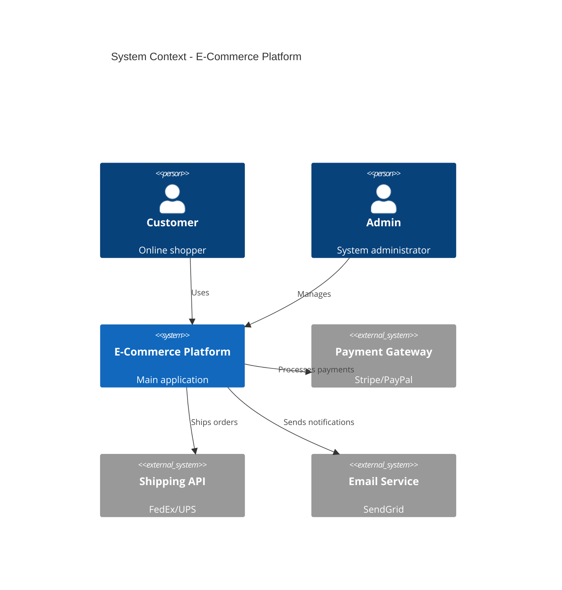
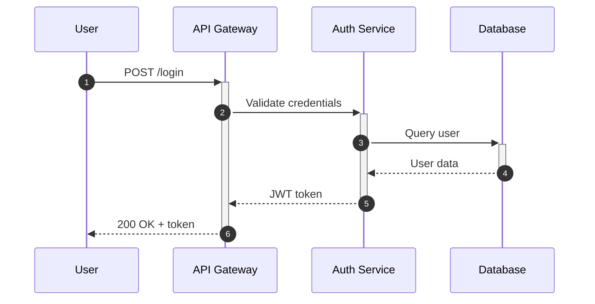

# Diagram Team

> **Version**: 1.0.0
> **Type**: Multi-Agent Parallel Execution Team
> **Purpose**: Comprehensive software diagram generation

---

## Overview

**Diagram Team** là một multi-agent team chuyên trực quan hóa sơ đồ của mọi dự án phần mềm. Team hoạt động với cơ chế song song - tất cả các diagrammer agents hoạt động cùng lúc sau khi khám phá dự án.

### Key Features

- **10 Specialized Agents** - 2 core + 7 diagrammers + 1 validator
- **Parallel Execution** - 7 diagram types generated simultaneously
- **Deep Verification** - Cross-checks against actual codebase
- **Mermaid Output** - Universal compatibility

---

## Architecture

```
DIAGRAM-TEAM v1.0
├── CORE DIVISION (2)
│   ├── 🎭 Maestro      - Orchestration & coordination
│   └── 🔍 Explorer     - Codebase analysis
│
├── DIAGRAMMER DIVISION (7) - PARALLEL
│   ├── 🏛️ Architect    - C4 System/Container diagrams
│   ├── ⏱️ Sequencer    - Sequence diagrams
│   ├── 📦 Classifier   - Class/Entity diagrams
│   ├── 🗄️ Modeler      - ERD/Database diagrams
│   ├── 📂 Mapper       - Directory structure
│   ├── 🧠 Logician     - Logic flowcharts
│   └── 🎨 Designer     - UI/UX flow diagrams
│
└── VERIFICATION DIVISION (1)
    └── ✅ Validator    - Deep accuracy verification
```

---

## Workflow

### 4-Phase Protocol

```
PHASE 1: EXPLORE (Sequential)
    🔍 Explorer analyzes codebase
    Output: exploration-report.md
         ↓

PHASE 2: GENERATE (Parallel - 7 workers)
    ┌────────┬────────┬────────┬────────┬────────┬────────┬────────┐
    │Architect│Sequencer│Classifier│Modeler│Mapper│Logician│Designer│
    └────────┴────────┴────────┴────────┴────────┴────────┴────────┘
    Output: 7 Mermaid diagrams
         ↓

PHASE 3: VERIFY (Sequential)
    ✅ Validator cross-checks each diagram
    Output: verification-report.md
         ↓

PHASE 4: AGGREGATE (Sequential)
    🎭 Maestro combines all outputs
    Output: Final diagram package
```

---

## Usage

### Quick Start

```bash
# Analyze current directory
/microai:diagram

# Analyze specific project
/microai:diagram /path/to/project

# Specific diagram types only
/microai:diagram --type architecture,sequence,erd
```

### Options

| Option | Description |
|--------|-------------|
| `--type` | Comma-separated diagram types |
| `--quick` | Skip verification phase |
| `--output` | Custom output directory |

### Diagram Types

| Type | Agent | Mermaid Syntax |
|------|-------|----------------|
| `architecture` | Architect | C4Context, C4Container |
| `sequence` | Sequencer | sequenceDiagram |
| `class` | Classifier | classDiagram |
| `erd` | Modeler | erDiagram |
| `directory` | Mapper | graph TD |
| `logic` | Logician | flowchart |
| `uiux` | Designer | stateDiagram-v2 |

---

## Output Structure

```
output/{project}/diagrams/
├── README.md                  # Index & quick links
├── exploration-report.md      # Codebase analysis
├── session-summary.md         # Generation stats
├── diagrams/
│   ├── architecture.mmd       # C4 diagrams
│   ├── sequences.mmd          # Sequence diagrams
│   ├── classes.mmd            # Class diagrams
│   ├── erd.mmd                # Database schema
│   ├── directory.mmd          # Project structure
│   ├── logic.mmd              # Algorithm flows
│   └── uiux.mmd               # UI navigation
└── verification/
    └── verification-report.md # Accuracy metrics
```

---

## Verification System

The Validator agent performs deep verification:

### Check Types

| Check | Description |
|-------|-------------|
| `entity_exists` | Verify entities exist in codebase |
| `relationship_valid` | Verify relationships are accurate |
| `completeness` | Compare discovered vs diagrammed |
| `naming_match` | Verify names match actual code |
| `api_verification` | Check API endpoints (sequence) |
| `schema_verification` | Check database schema (ERD) |

### Accuracy Scoring

- Each diagram receives accuracy score (0-100%)
- Overall score aggregates all diagrams
- Issues categorized: Critical, Warning, Suggestion

---

## File Structure

```
.microai/teams/diagram-team/
├── README.md                    # This file
├── ARCHITECTURE.md              # System design
├── workflow.md                  # Main orchestration
├── agents/
│   ├── core/
│   │   ├── maestro-agent.md     # Orchestrator
│   │   └── explorer-agent.md    # Codebase analyzer
│   ├── diagrammers/
│   │   ├── architect-agent.md   # C4 diagrams
│   │   ├── sequencer-agent.md   # Sequence diagrams
│   │   ├── classifier-agent.md  # Class diagrams
│   │   ├── modeler-agent.md     # ERD diagrams
│   │   ├── mapper-agent.md      # Directory diagrams
│   │   ├── logician-agent.md    # Logic diagrams
│   │   └── designer-agent.md    # UI/UX diagrams
│   └── verification/
│       └── validator-agent.md   # Deep verification
├── steps/
│   ├── step-01-init.md
│   ├── step-02-explore.md
│   ├── step-03a-architecture.md # ┐
│   ├── step-03b-sequence.md     # │
│   ├── step-03c-class.md        # │ PARALLEL
│   ├── step-03d-erd.md          # │
│   ├── step-03e-directory.md    # │
│   ├── step-03f-logic.md        # │
│   ├── step-03g-uiux.md         # ┘
│   ├── step-04-verify.md
│   ├── step-05-aggregate.md
│   └── step-06-summary.md
├── knowledge/
│   ├── shared/
│   │   ├── mermaid-syntax.md
│   │   ├── diagram-best-practices.md
│   │   └── verification-patterns.md
│   ├── exploration/
│   │   ├── tech-stack-detection.md
│   │   └── component-patterns.md
│   └── diagrams/
│       ├── c4-model.md
│       ├── sequence-patterns.md
│       ├── class-diagram-patterns.md
│       ├── erd-patterns.md
│       ├── directory-patterns.md
│       ├── flowchart-patterns.md
│       └── uiux-flow-patterns.md
├── templates/
│   ├── exploration-report-template.md
│   ├── diagram-template.mmd
│   ├── verification-report-template.md
│   ├── session-summary-template.md
│   └── readme-template.md
├── communication/
├── checkpoints/
├── kanban/
├── logs/
├── memory/
└── sessions/
```

---

## Examples

### Example Output: Architecture Diagram



### Example Output: Sequence Diagram



---

## Best Practices

1. **Explore First** - Always run exploration before generating
2. **Verify Always** - Never skip verification for production docs
3. **Iterate** - Regenerate after significant code changes
4. **Export** - Convert Mermaid to SVG/PNG for static docs

---

## Troubleshooting

### Common Issues

| Issue | Solution |
|-------|----------|
| Empty diagram | Check if project has relevant code |
| Low accuracy | Review verification report for specifics |
| Missing entities | Run exploration with broader scope |
| Syntax errors | Check Mermaid syntax in knowledge files |

### Logs

Session logs are stored in:
- `logs/` - Execution logs
- `memory/` - Agent memory
- `sessions/` - Session data

---

## Contributing

To extend the diagram team:

1. Add new agent in `agents/diagrammers/`
2. Add corresponding step in `steps/`
3. Add knowledge file in `knowledge/diagrams/`
4. Update workflow.md parallel config
5. Update slash command

---

## Credits

Built with MicroAI Multi-Agent Framework

- **Pattern Reference**: one-page-team (parallel execution)
- **Agent Template**: father-agent/knowledge/13-team-agent-template.md
- **Architecture Reference**: deep-thinking-team

---

*Diagram Team v1.0 - Making software architecture visible*
