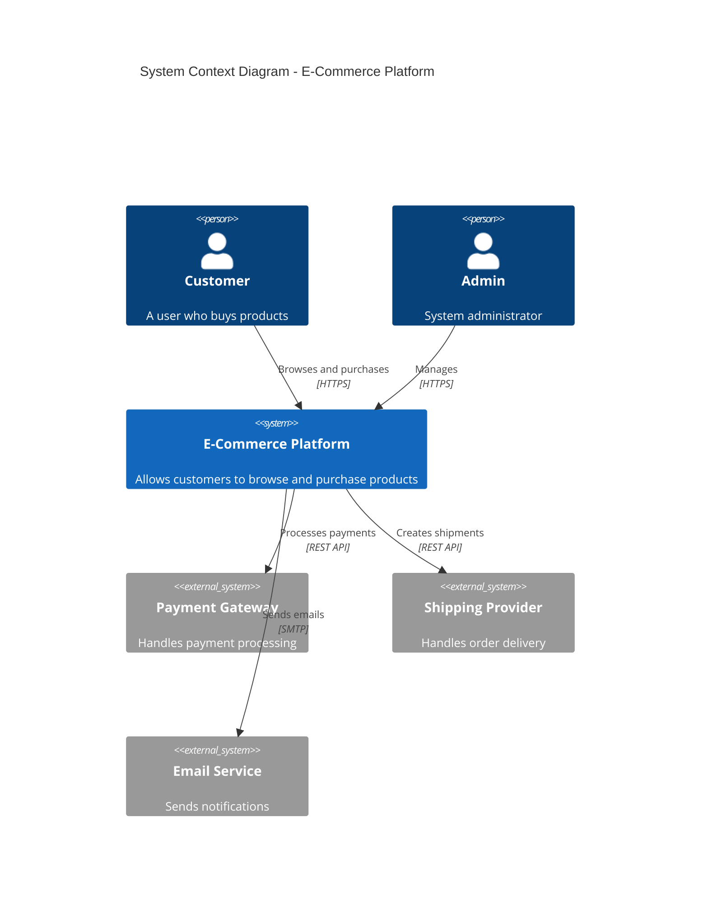
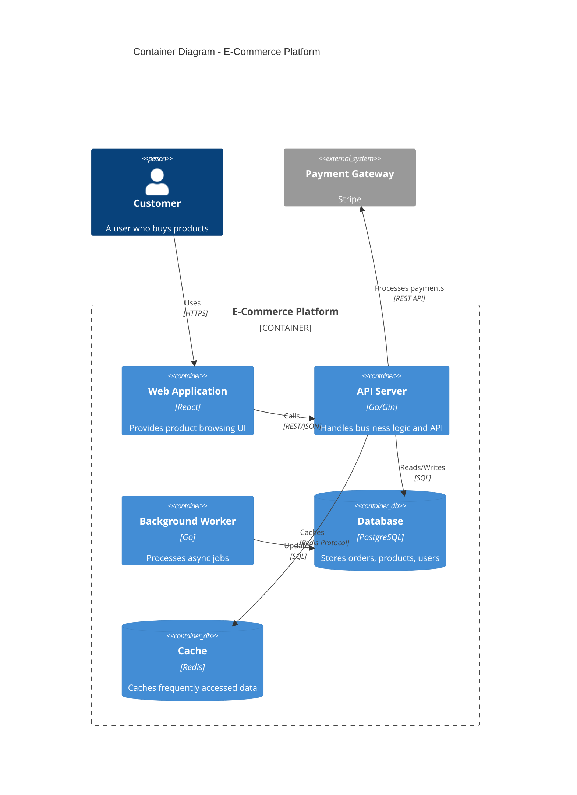
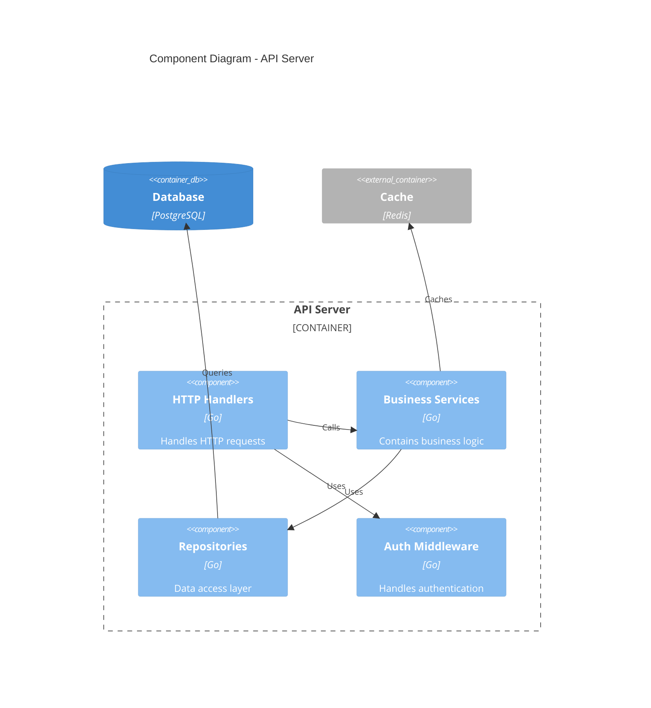
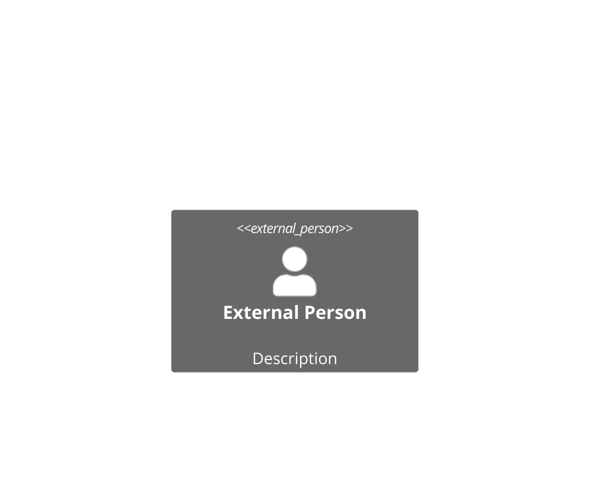
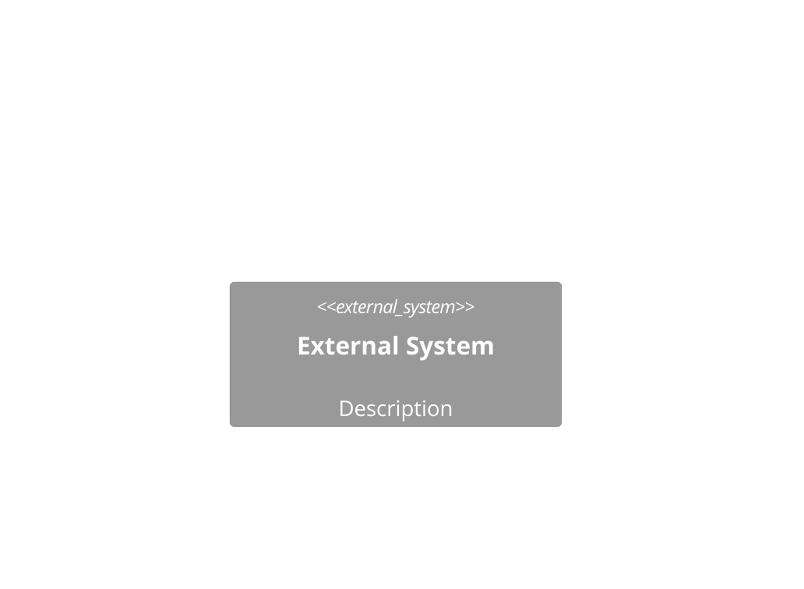
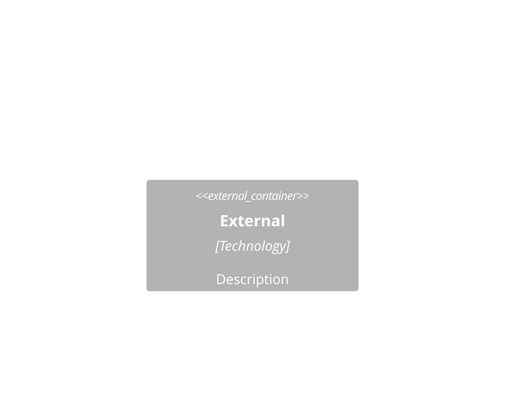

# C4 Model Reference

Guidelines cho tạo C4 diagrams với Mermaid.

---

## C4 Overview

C4 = **C**ontext, **C**ontainers, **C**omponents, **C**ode

```
Level 1: System Context
    ↓
Level 2: Container
    ↓
Level 3: Component
    ↓
Level 4: Code (rarely needed)
```

---

## Level 1: System Context

**Purpose**: Big picture - how system fits in the world

**Elements**:
- **Person** - User or actor
- **System** - The system being designed
- **System_Ext** - External systems

### Mermaid Syntax



### Guidelines

- Keep it simple (5-10 elements max)
- Focus on key interactions
- Don't show internal details
- Label relationships with protocol

---

## Level 2: Container

**Purpose**: High-level technical shape

**Elements**:
- **Container** - Deployable unit (app, database, etc.)
- **ContainerDb** - Database
- **Container_Ext** - External container
- **Container_Boundary** - Group containers

### Mermaid Syntax



### Guidelines

- Show deployable units
- Include technology choices
- Show data storage
- Group with boundaries

---

## Level 3: Component

**Purpose**: Internal structure of a container

**Elements**:
- **Component** - A component within container
- **Component_Ext** - External component

### Mermaid Syntax



### Guidelines

- Focus on one container
- Show logical components
- Map dependencies
- Keep manageable (10-15 components)

---

## Element Reference

### People



### Systems



### Containers



### Boundaries

```mermaid
C4Container
    Container_Boundary(id, "Name") {
        Container(...)
    }

    Enterprise_Boundary(id, "Name") {
        System(...)
    }
```

### Relationships

```mermaid
C4Context
    Rel(from, to, "Label")
    Rel(from, to, "Label", "Technology")
    Rel_D(from, to, "Label")  # Down
    Rel_U(from, to, "Label")  # Up
    Rel_L(from, to, "Label")  # Left
    Rel_R(from, to, "Label")  # Right
```

---

## Best Practices

1. **Start high, go low** - Context → Container → Component
2. **One level per diagram** - Don't mix
3. **Clear descriptions** - What it does, not how
4. **Technology labels** - On containers and components
5. **Relationship labels** - Include protocol
6. **Use boundaries** - Group related items
7. **Limit complexity** - 5-10 elements per diagram
