# Class Diagram Patterns

Reference cho tạo class diagrams hiệu quả.

---

## Relationship Types

### Inheritance (Generalization)

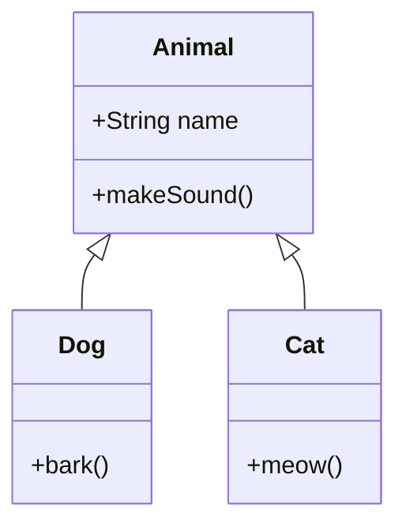

### Interface Implementation

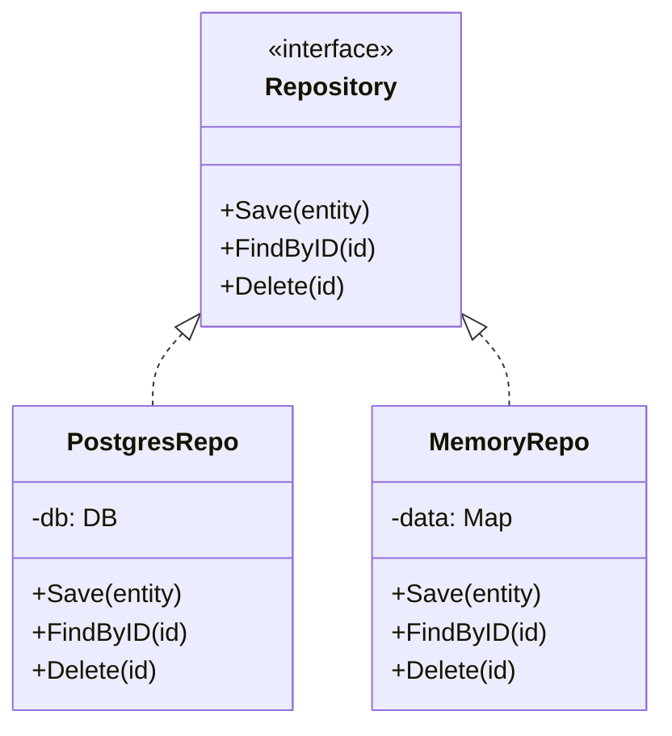

### Association

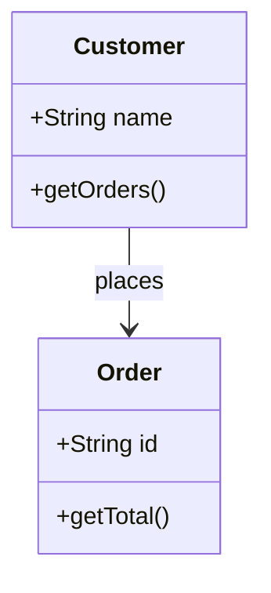

### Composition

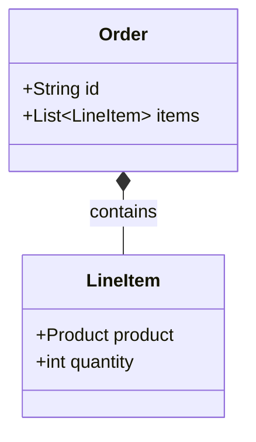

### Aggregation

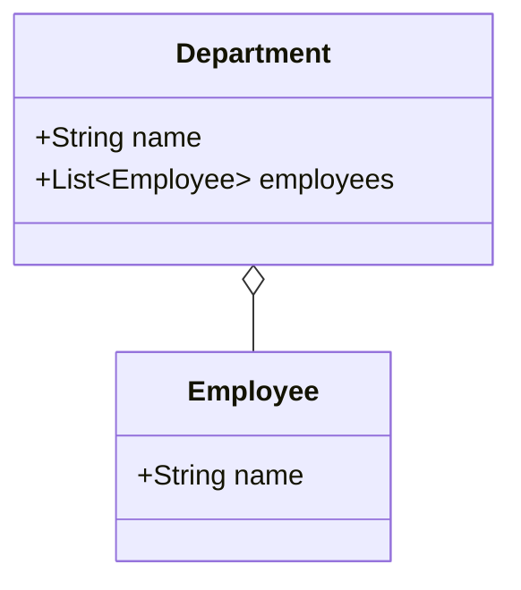

### Dependency

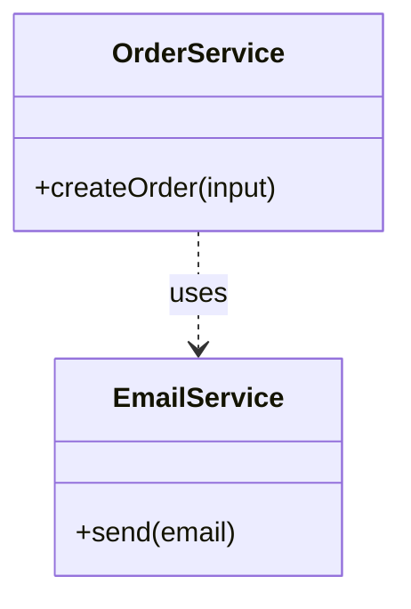

---

## Common Patterns

### Repository Pattern

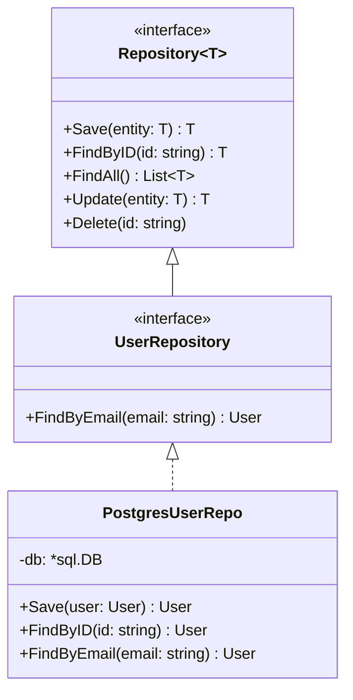

### Service Pattern

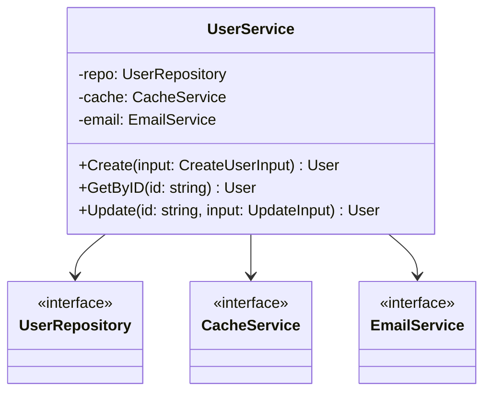

### Factory Pattern

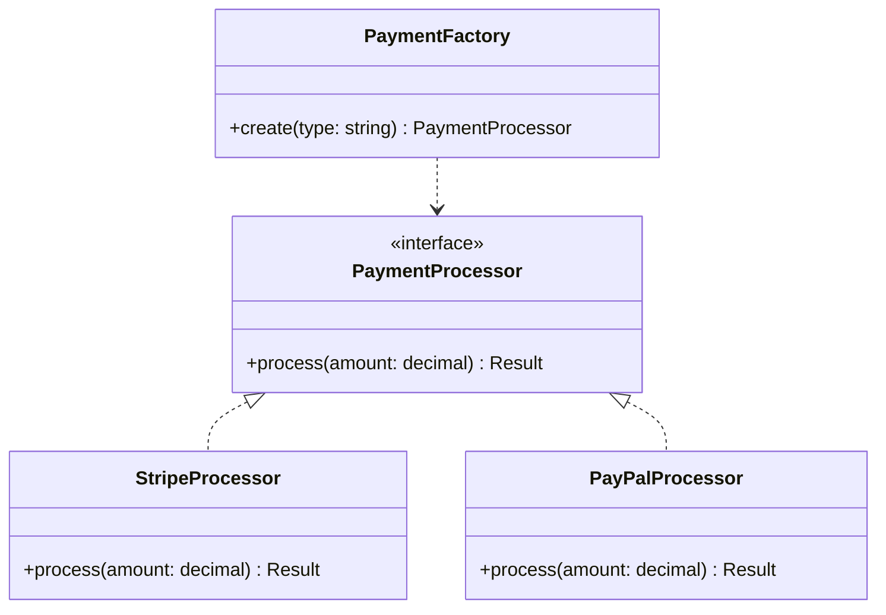

### Domain Model

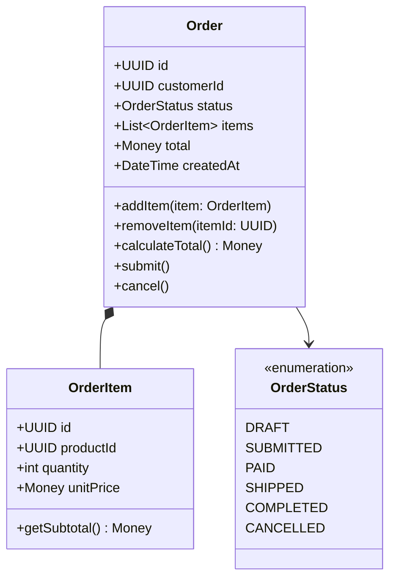

---

## Visibility Modifiers

| Symbol | Access |
|--------|--------|
| `+` | Public |
| `-` | Private |
| `#` | Protected |
| `~` | Package/Internal |

---

## Annotations

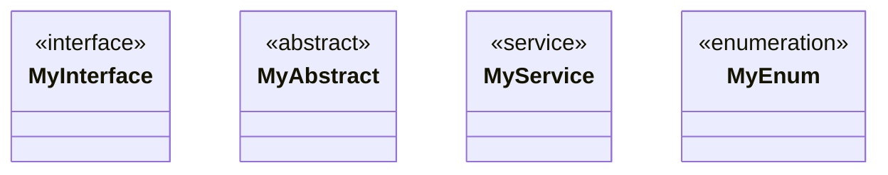

---

## Best Practices

1. **Group by domain** - Separate domain models from services
2. **Show public interfaces** - Hide implementation details
3. **Use proper relationships** - Composition vs Aggregation
4. **Include key methods** - Skip getters/setters
5. **Use annotations** - Mark interfaces, abstracts
6. **Limit complexity** - 10-15 classes per diagram
