# Directory Structure Patterns

Reference cho visualizing project layouts.

---

## Basic Syntax

---

## Common Project Structures

### Go Project (Clean Architecture)

### Node.js/TypeScript Project

### Python Project (FastAPI)

### Monorepo (Turborepo/Nx)

### Microservices

---

## Styling

### With Icons

```mermaid
flowchart TD
    A[("📁 project")] --> B["📁 src"]
    A --> C["📁 tests"]
    A --> D["📄 package.json"]
    A --> E["📄 README.md"]

    B --> B1["📁 components"]
    B --> B2["📁 pages"]

    C --> C1["📁 unit"]
    C --> C2["📁 e2e"]
```

### With File Types

---

## Best Practices

1. **Focus on key directories** - Skip node_modules, .git
2. **Show 3-4 levels deep** - Not too detailed
3. **Group by purpose** - src, tests, configs, docs
4. **Highlight entry points** - main.go, index.ts
5. **Use consistent naming** - Match actual project
6. **Include config files** - package.json, go.mod
7. **Top-down layout** - TD direction
