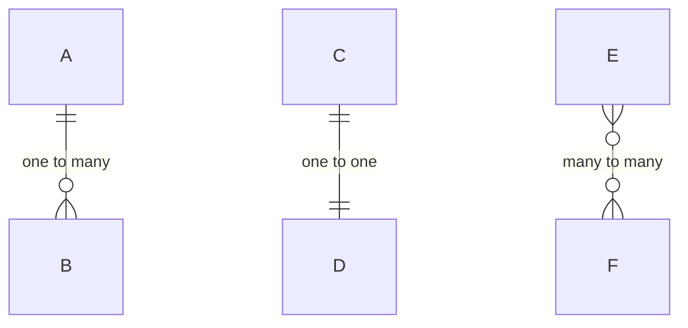
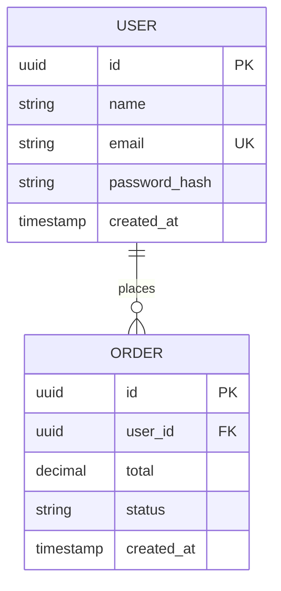
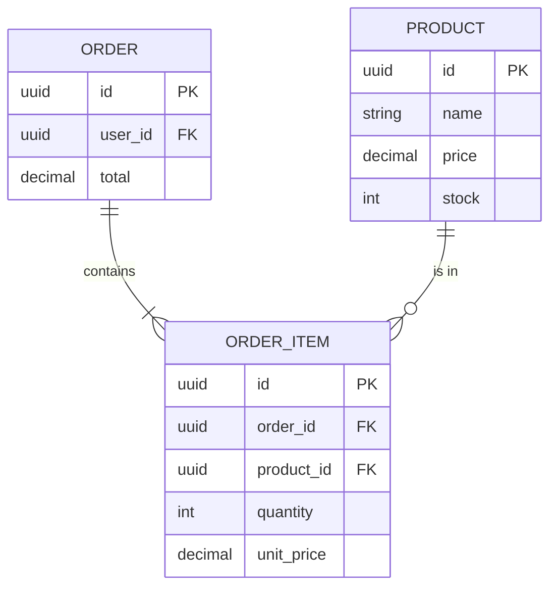
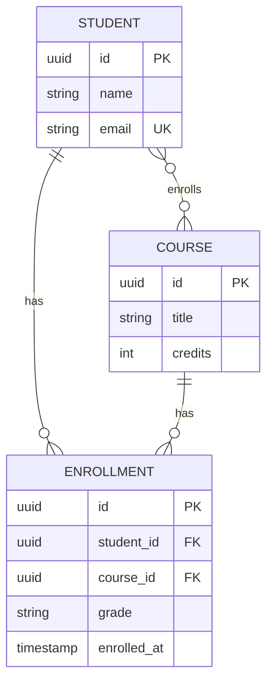
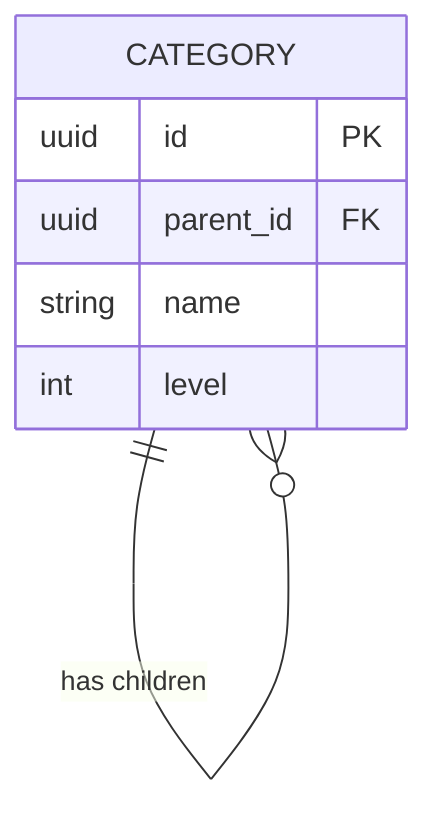
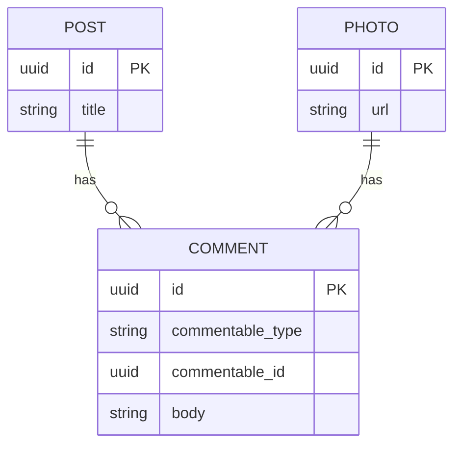
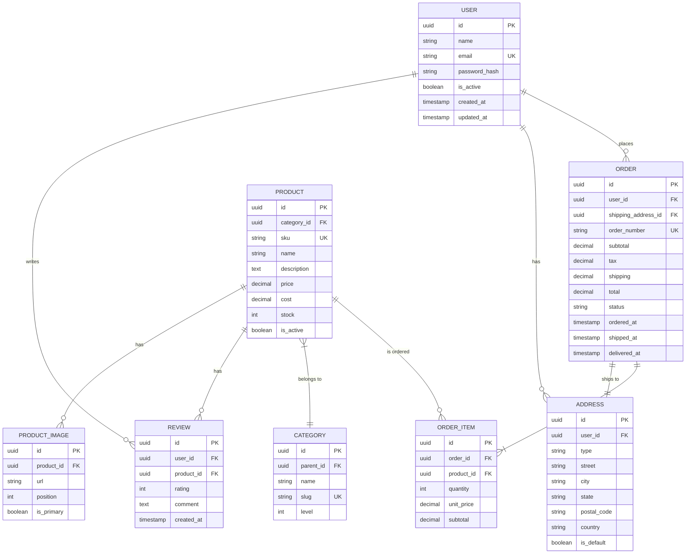

# ERD Patterns

Reference cho tạo Entity-Relationship diagrams.

---

## Basic Syntax

```mermaid
erDiagram
    TABLE_NAME {
        type column_name constraints
    }
```

### Column Types
- `uuid`, `int`, `bigint`
- `string`, `text`
- `decimal`, `float`
- `boolean`
- `timestamp`, `date`
- `json`

### Constraints
- `PK` - Primary Key
- `FK` - Foreign Key
- `UK` - Unique Key

---

## Relationship Notation

| Left | Right | Meaning |
|------|-------|---------|
| `\|o` | `o\|` | Zero or one |
| `\|\|` | `\|\|` | Exactly one |
| `}o` | `o{` | Zero or more |
| `}\|` | `\|{` | One or more |

### Examples



---

## Common Patterns

### User and Orders (1:N)



### Order with Items (1:N with Product)



### Many-to-Many with Junction Table



### Self-Reference (Hierarchical)



### Polymorphic Association



---

## Full E-Commerce Example



---

## Best Practices

1. **Always use primary keys** - `uuid id PK`
2. **Mark foreign keys** - `uuid user_id FK`
3. **Show unique constraints** - `string email UK`
4. **Include important columns only** - Skip audit fields if not relevant
5. **Name relationships** - Use verbs: "places", "contains", "has"
6. **Group related tables** - Keep related entities near each other
7. **Use singular table names** - `USER` not `USERS`
