# Flowchart Patterns

Reference cho tạo logic flow diagrams.

---

## Basic Syntax

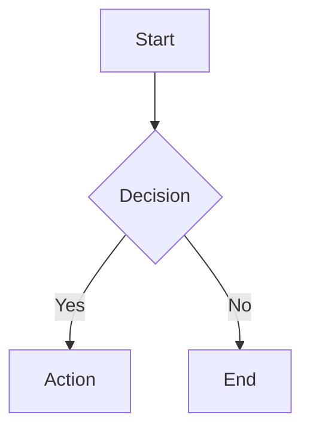

---

## Node Shapes

| Syntax | Shape | Use For |
|--------|-------|---------|
| `[text]` | Rectangle | Process/Action |
| `{text}` | Diamond | Decision |
| `([text])` | Stadium | Start/End |
| `[[text]]` | Subroutine | Sub-process |
| `[(text)]` | Cylinder | Database |
| `((text))` | Circle | Connector |
| `>text]` | Asymmetric | Note |
| `{{text}}` | Hexagon | Preparation |

---

## Common Patterns

### Linear Process

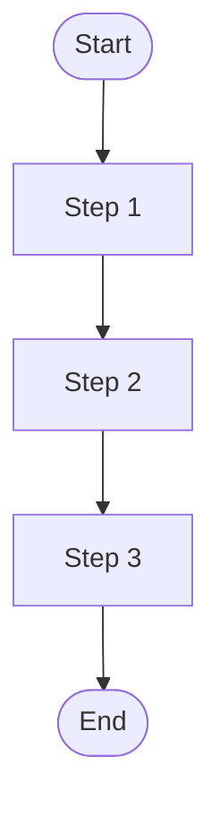

### If-Else

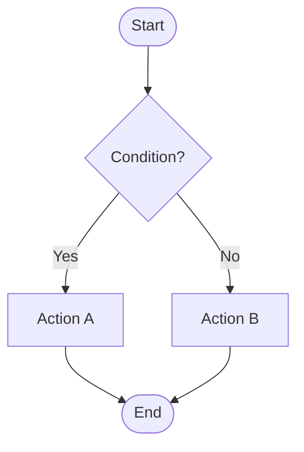

### Multiple Conditions

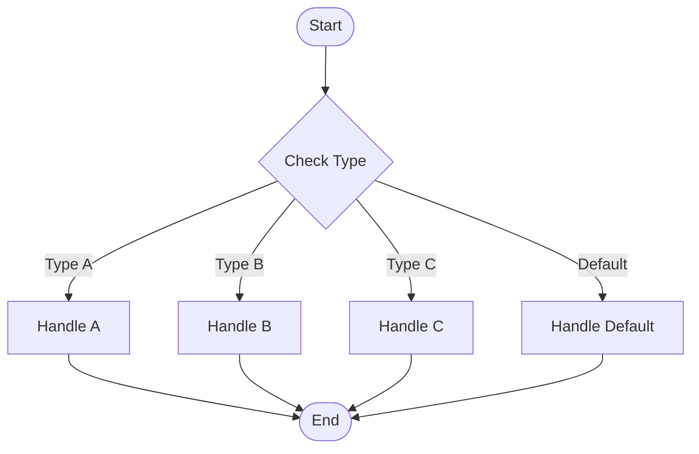

### Loop (While)

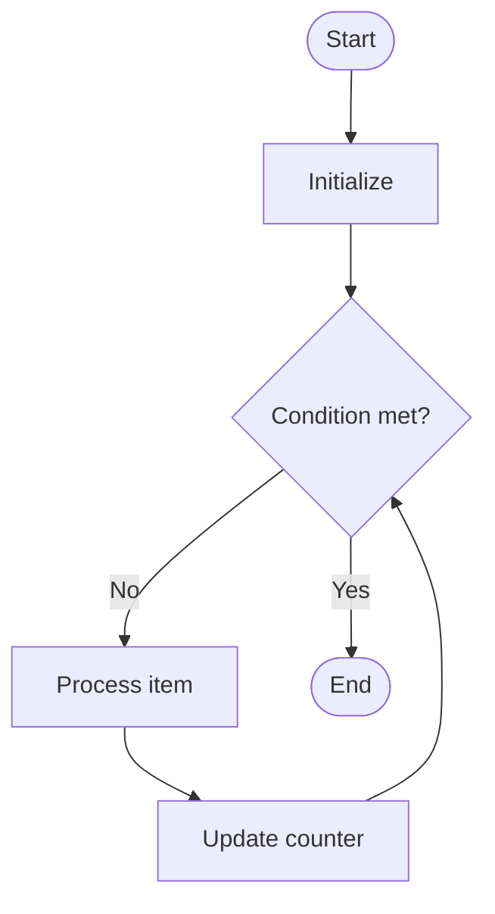

### Loop (For Each)

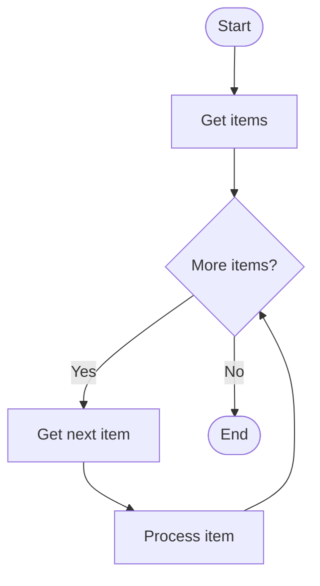

### Try-Catch

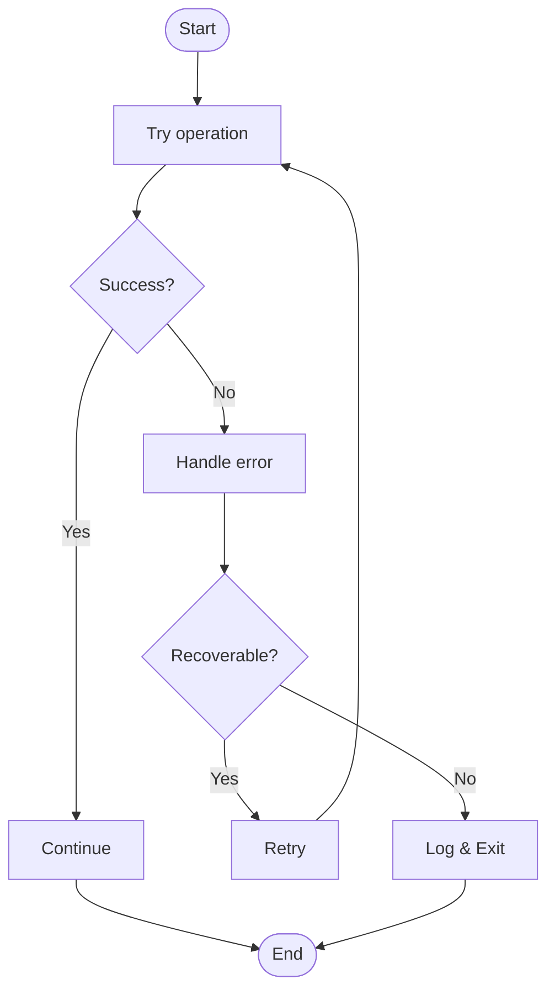

---

## Advanced Patterns

### Request Handling

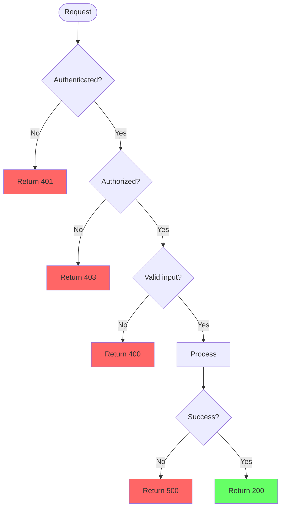

### Order Processing

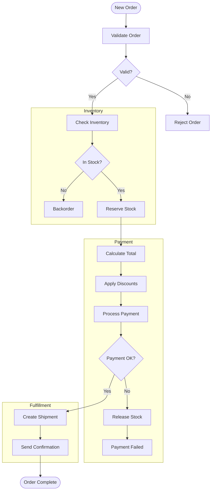

### State Machine

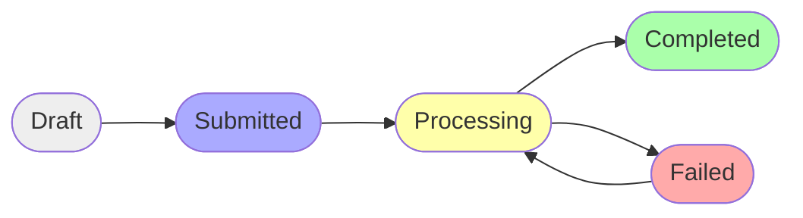

---

## Subgraphs

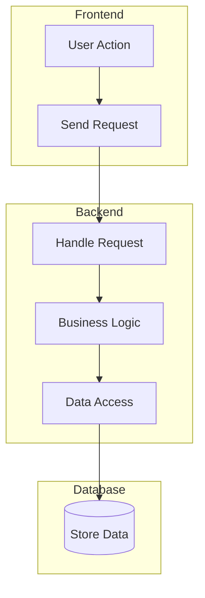

---

## Styling

### Node Colors

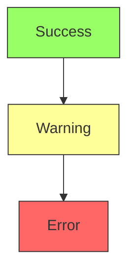

### Link Styles

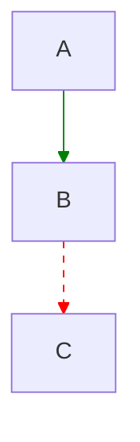

---

## Best Practices

1. **Clear start/end** - Use stadium shapes
2. **Decision diamonds** - Use for all branches
3. **Consistent direction** - TD for vertical, LR for horizontal
4. **Group with subgraphs** - Related steps together
5. **Label arrows** - Especially for decisions
6. **Color code** - Success/error paths
7. **Keep simple** - Max 15-20 nodes
