# Sequence Diagram Patterns

Reference cho tạo sequence diagrams hiệu quả.

---

## Common Patterns

### 1. Request-Response

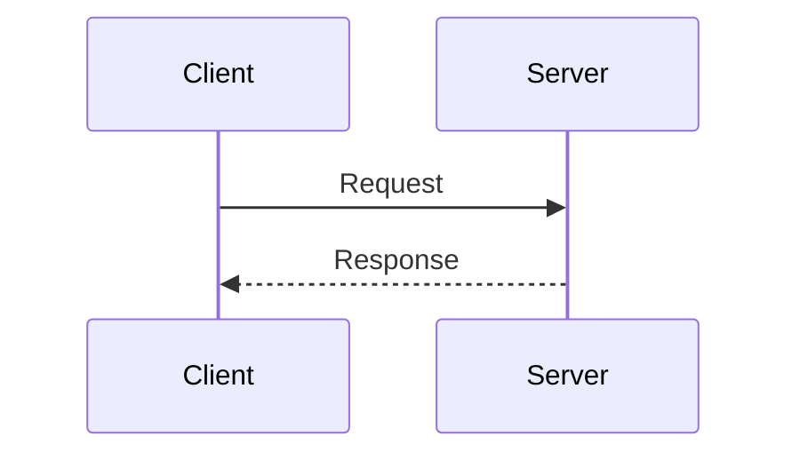

### 2. Layered Architecture

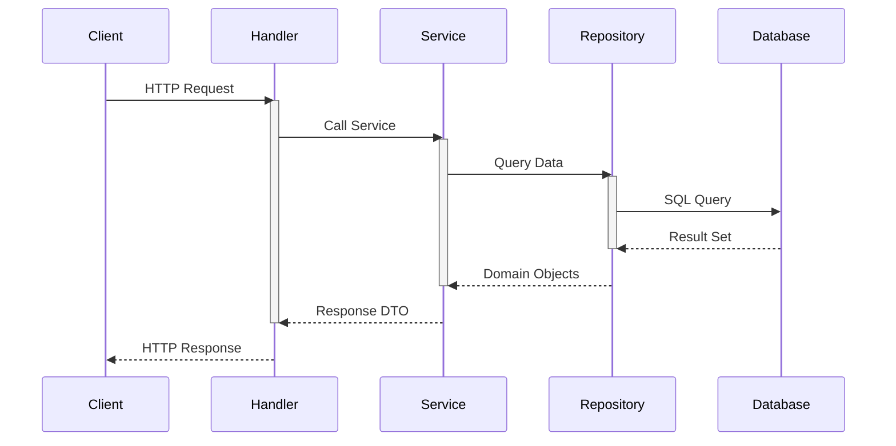

### 3. Authentication Flow

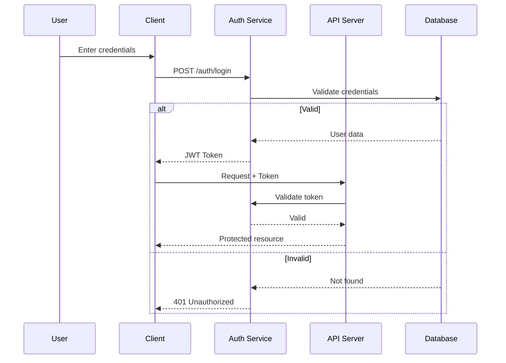

### 4. CRUD Operations

#### Create
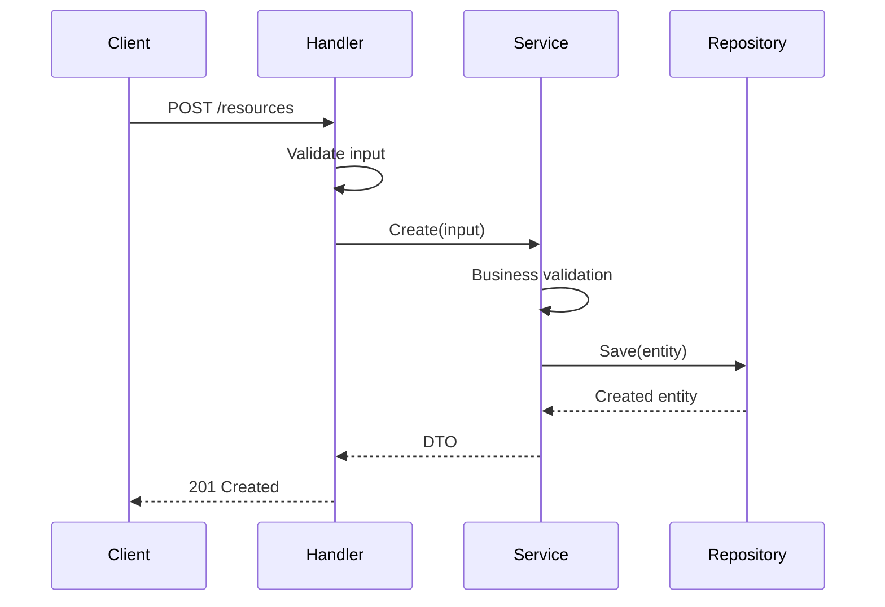

#### Read
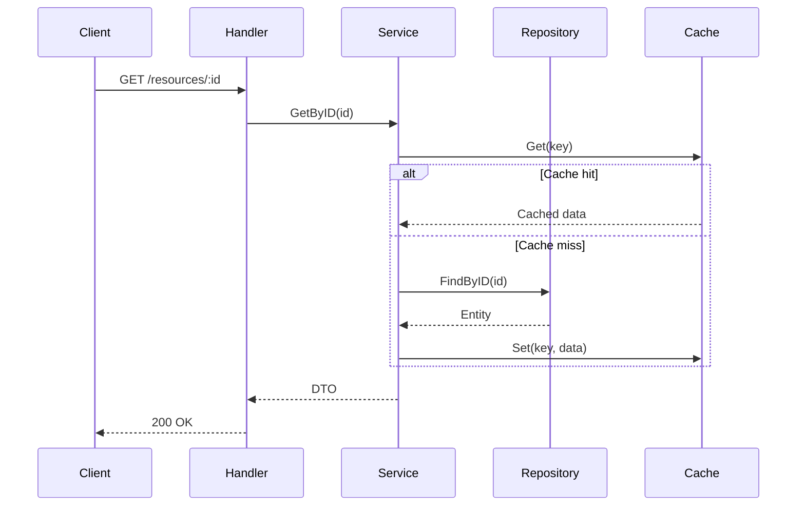

### 5. Async Processing

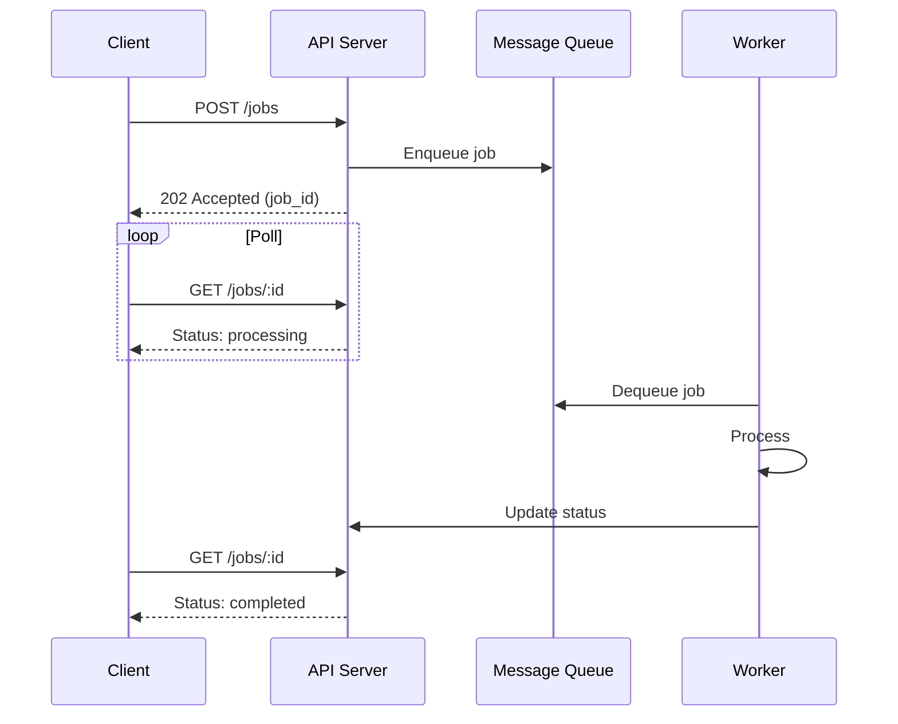

### 6. Webhook/Callback

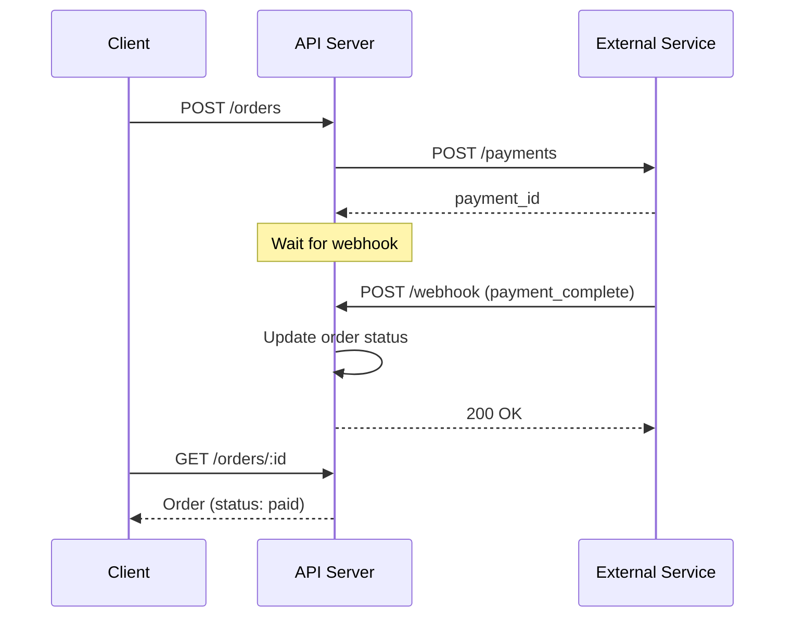

---

## Advanced Features

### Loops

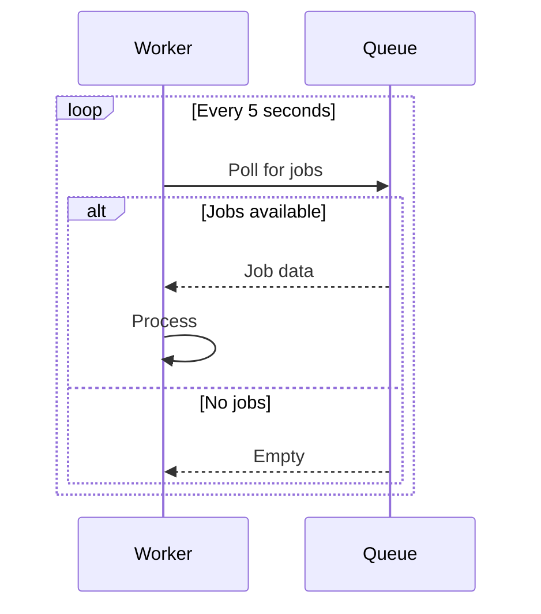

### Parallel

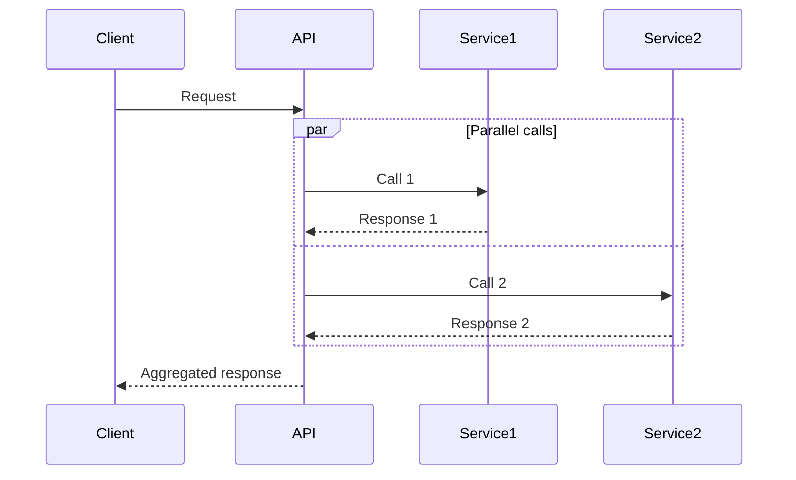

### Critical Section

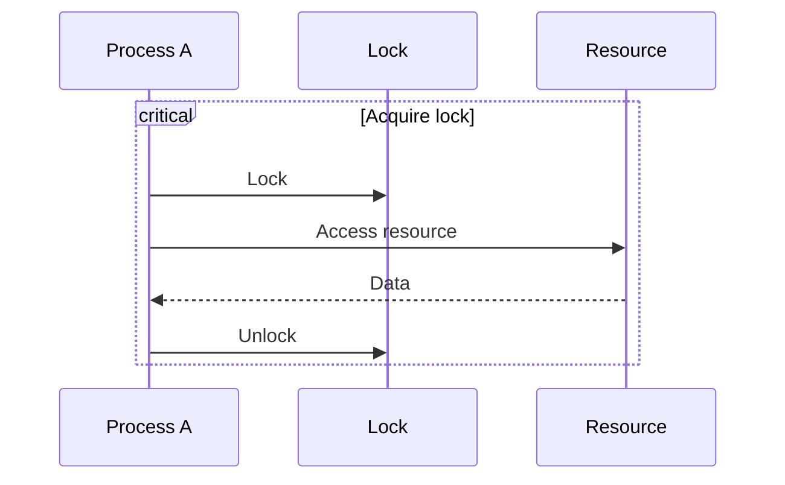

### Notes

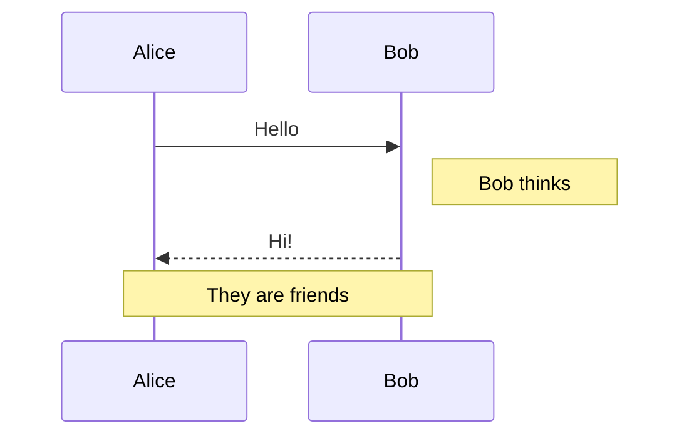

---

## Best Practices

1. **Name participants clearly** - Use short, meaningful names
2. **Show activation** - Use activate/deactivate for long operations
3. **Group related messages** - Use boxes or notes
4. **Show alternatives** - Use alt/else for branches
5. **Limit width** - Max 5-6 participants
6. **Focus on key flow** - Skip logging, trivial calls
7. **Include timing** - Note delays when relevant
