# UI/UX Flow Patterns

Reference cho tạo user journey và screen flow diagrams.

---

## State Diagrams for UI

### Basic Navigation

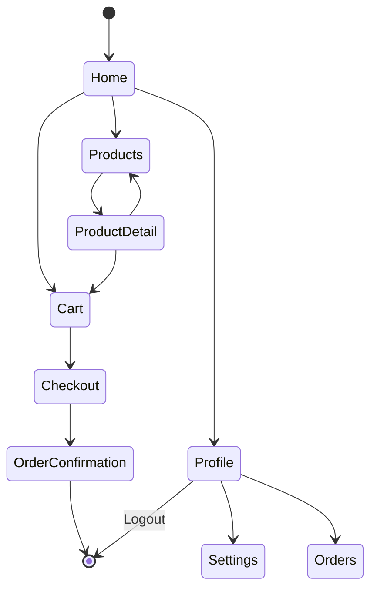

### Authentication Flow

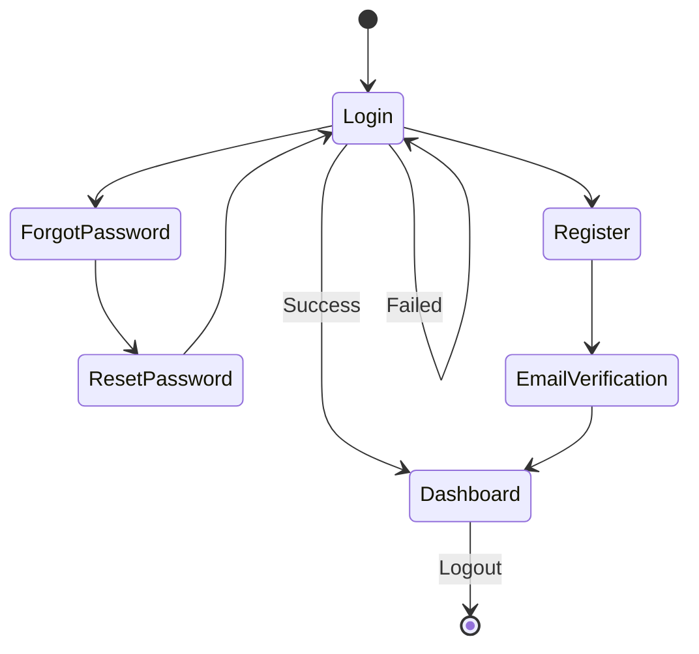

### Form States

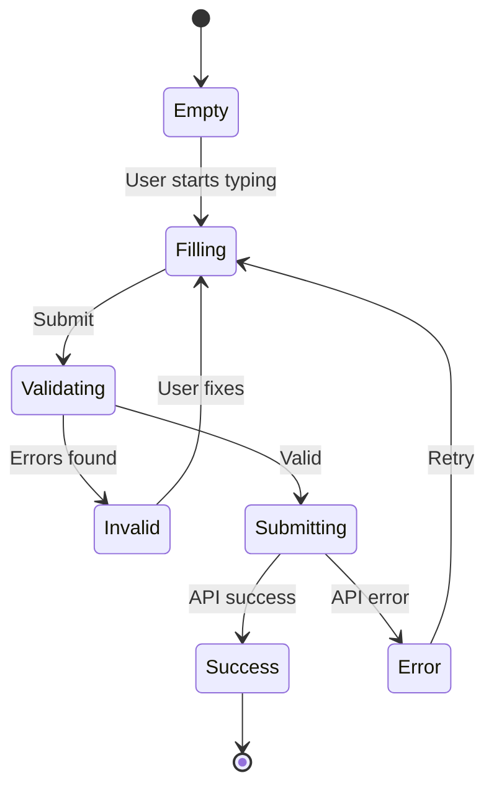

---

## Screen Navigation Flows

### E-Commerce App

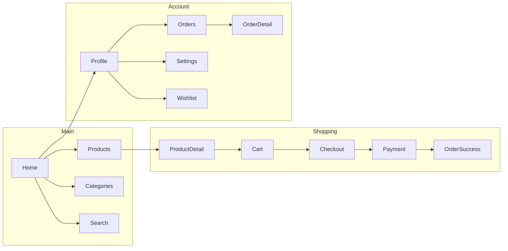

### Mobile App Tabs

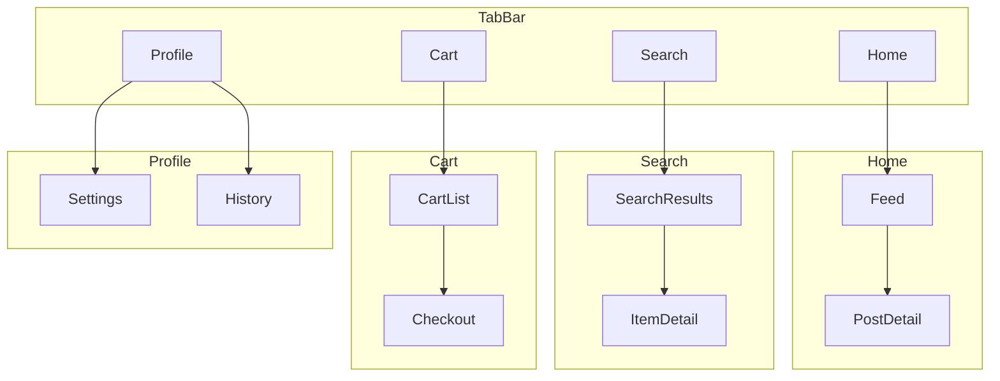

---

## User Journey Maps

### Onboarding Journey

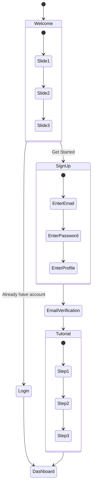

### Purchase Journey

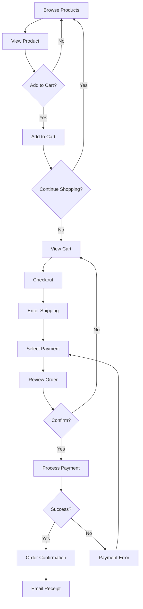

---

## Component States

### Button States

```mermaid
stateDiagram-v2
    [*] --> Default
    Default --> Hover: mouseenter
    Hover --> Default: mouseleave
    Hover --> Pressed: mousedown
    Pressed --> Hover: mouseup
    Default --> Focused: focus
    Focused --> Default: blur
    Default --> Disabled: disable()
    Disabled --> Default: enable()
    Default --> Loading: submit
    Loading --> Default: complete
```

### Modal States

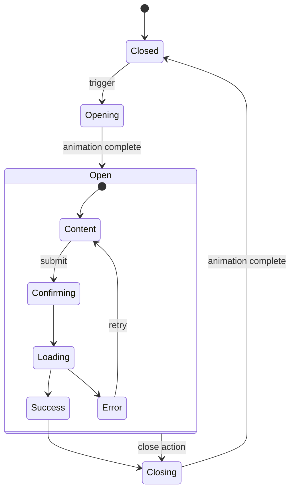

### Form Field States

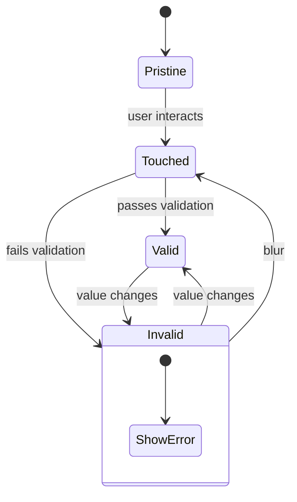

---

## Error Handling UI

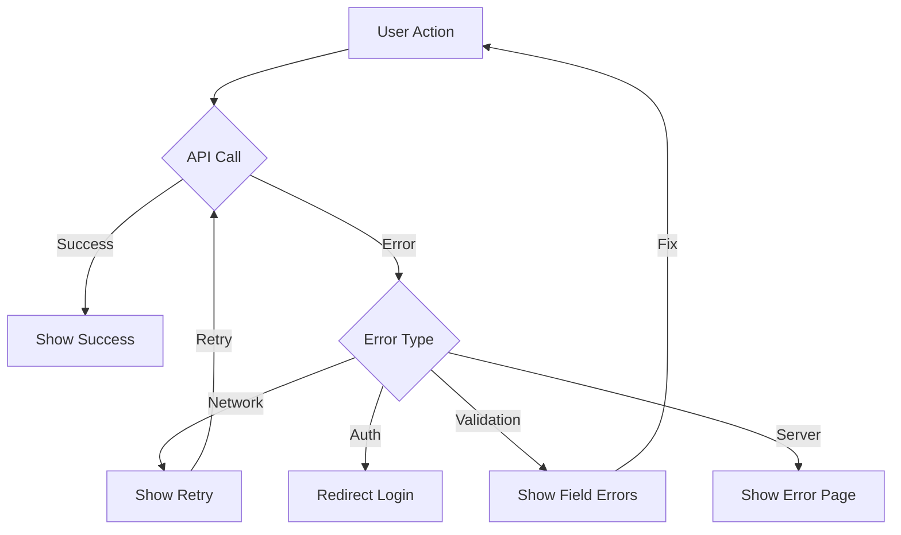

---

## Responsive States

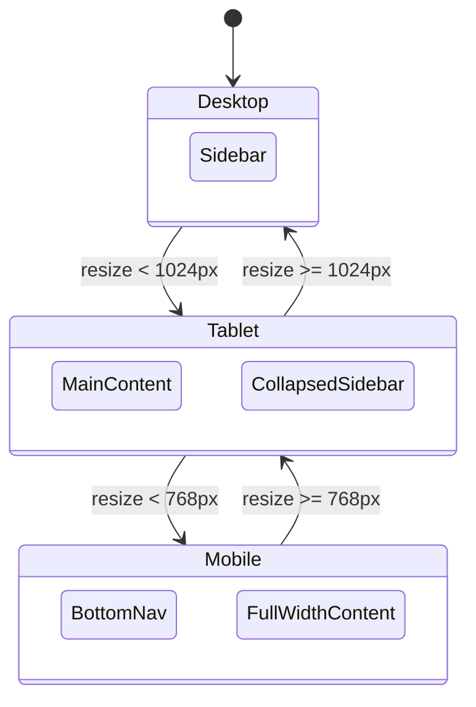

---

## Best Practices

1. **Start from user perspective** - What they see first
2. **Show happy path** - Main flow clearly
3. **Include error states** - How errors are shown
4. **Document transitions** - What triggers changes
5. **Use state diagrams** - For component states
6. **Use flowcharts** - For journeys
7. **Keep focused** - One journey per diagram
