# Mermaid Syntax Reference

Quick reference cho tất cả Mermaid diagram types được sử dụng trong Diagram-Team.

---

## 1. Flowchart

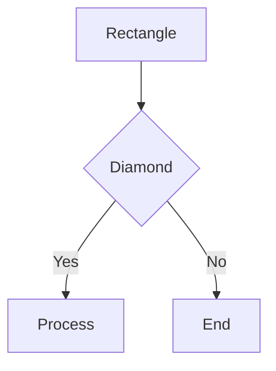

### Node Shapes
| Syntax | Shape |
|--------|-------|
| `[text]` | Rectangle |
| `{text}` | Diamond (decision) |
| `([text])` | Stadium |
| `[[text]]` | Subroutine |
| `[(text)]` | Cylinder (database) |
| `((text))` | Circle |

### Arrows
| Syntax | Type |
|--------|------|
| `-->` | Arrow |
| `---` | Line |
| `-.->` | Dotted arrow |
| `==>` | Thick arrow |

### Direction
- `TD` / `TB` = Top to Bottom
- `BT` = Bottom to Top
- `LR` = Left to Right
- `RL` = Right to Left

---

## 2. Sequence Diagram

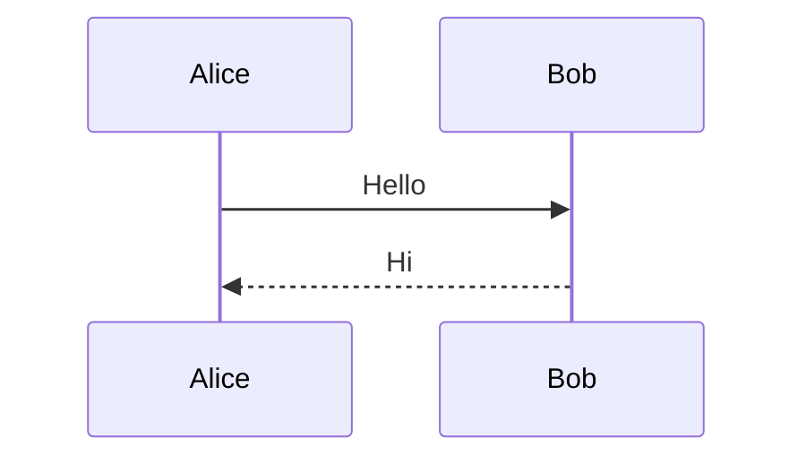

### Message Types
| Syntax | Type |
|--------|------|
| `->` | Solid line without arrow |
| `-->` | Dotted line without arrow |
| `->>` | Solid line with arrow |
| `-->>` | Dotted line with arrow |
| `-x` | Solid line with X |
| `--x` | Dotted line with X |

### Activation
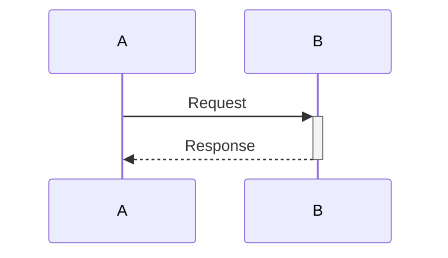

### Alt/Opt/Loop
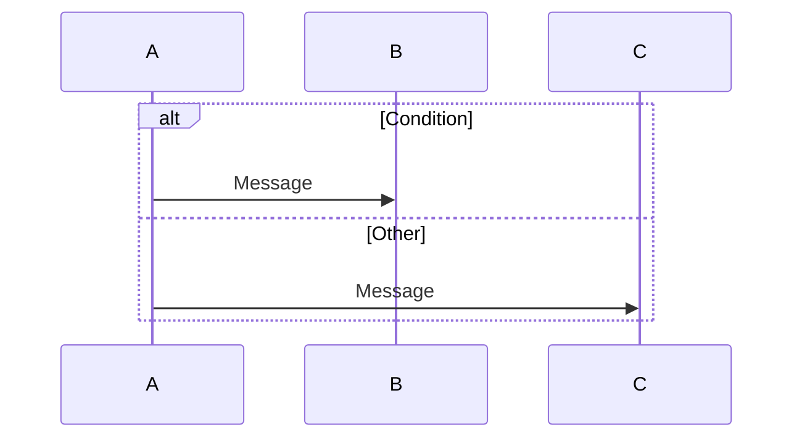

---

## 3. Class Diagram

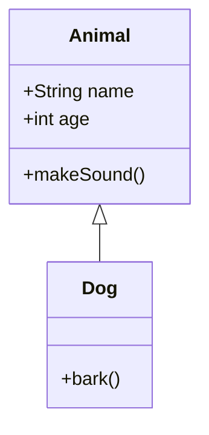

### Visibility
| Symbol | Access |
|--------|--------|
| `+` | Public |
| `-` | Private |
| `#` | Protected |
| `~` | Package |

### Relationships
| Syntax | Type |
|--------|------|
| `<\|--` | Inheritance |
| `<\|..` | Realization |
| `-->` | Association |
| `--*` | Composition |
| `--o` | Aggregation |
| `..>` | Dependency |

---

## 4. ERD (Entity Relationship)

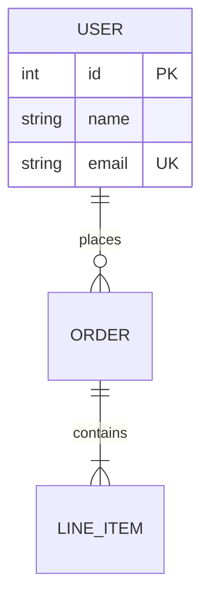

### Cardinality
| Syntax | Meaning |
|--------|---------|
| `\|\|` | Exactly one |
| `\|o` | Zero or one |
| `}o` | Zero or more |
| `}\|` | One or more |

---

## 5. State Diagram

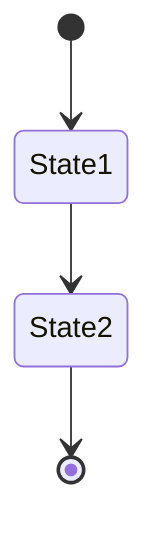

### Transitions
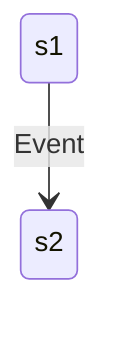

### Composite States
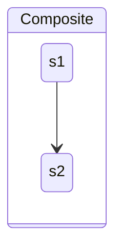

---

## 6. C4 Diagrams

### C4 Context
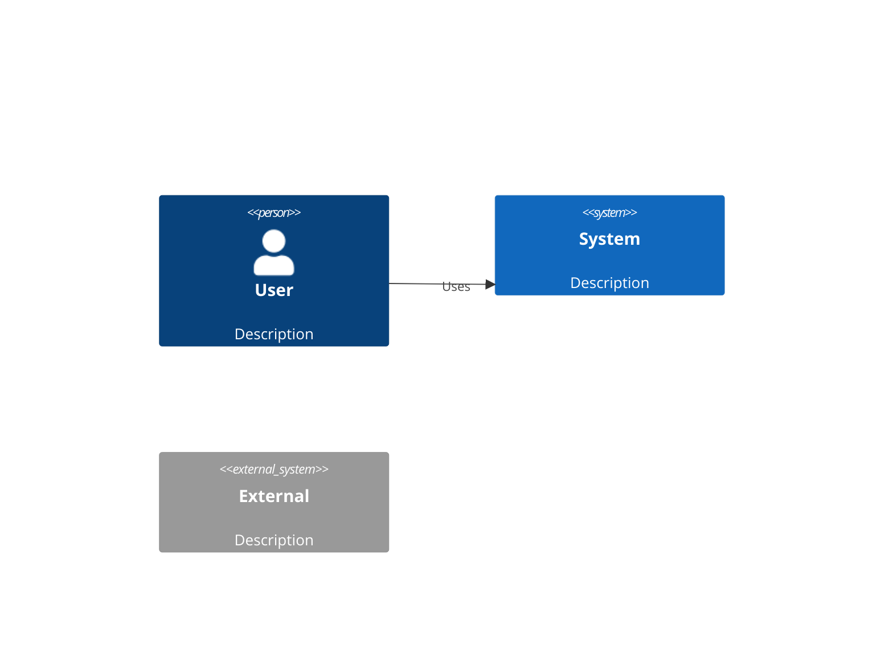

### C4 Container
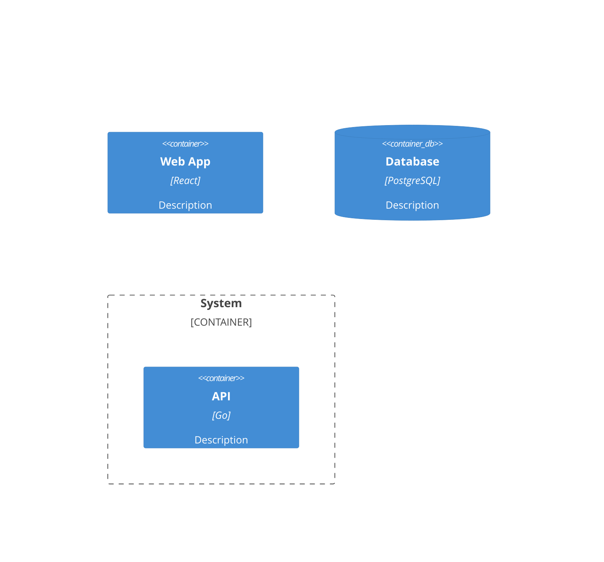

---

## 7. Graph (for Directory Structure)

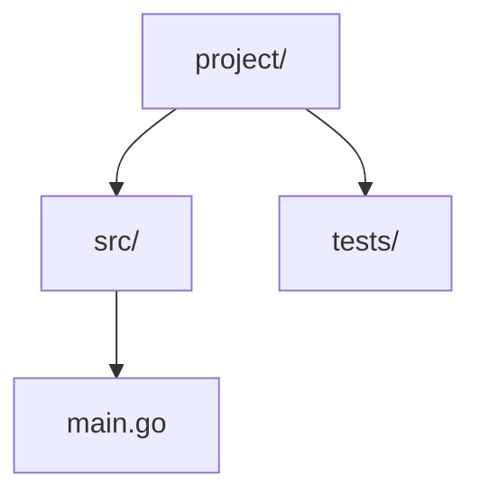

---

## Styling

### Node Style
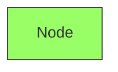

### Link Style
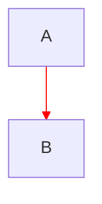

---

## Best Practices

1. **Keep it simple** - 7±2 elements per diagram
2. **Use subgraphs** - Group related items
3. **Clear labels** - Descriptive but concise
4. **Consistent direction** - TD for hierarchy, LR for flows
5. **Valid syntax** - Test in Mermaid Live Editor
