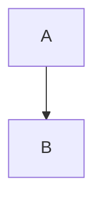

# {{PROJECT_NAME}} - Diagrams

> Generated by **Diagram Team** on {{TIMESTAMP}}

---

## Quick Links

| Diagram | Type | View |
|---------|------|------|
{{#DIAGRAMS}}
| [{{NAME}}](diagrams/{{FILENAME}}) | {{TYPE}} | {{PREVIEW_LINK}} |
{{/DIAGRAMS}}

---

## Overview

This package contains auto-generated diagrams for the **{{PROJECT_NAME}}** project.

### Tech Stack
- **Language**: {{PRIMARY_LANGUAGE}}
- **Framework**: {{FRAMEWORK}}
- **Architecture**: {{ARCHITECTURE_PATTERN}}

### What's Included
- **{{DIAGRAM_COUNT}} diagrams** covering architecture, data flow, and structure
- **Exploration report** with detailed codebase analysis
- **Verification report** with accuracy metrics

---

## Diagrams

### 🏛️ Architecture Diagram
**File**: [`diagrams/architecture.mmd`](diagrams/architecture.mmd)

Shows the high-level system context and container views using C4 model.

```mermaid
{{ARCH_PREVIEW}}
```

---

### ⏱️ Sequence Diagrams
**File**: [`diagrams/sequences.mmd`](diagrams/sequences.mmd)

Shows the main interaction flows and API call sequences.

```mermaid
{{SEQ_PREVIEW}}
```

---

### 📦 Class Diagram
**File**: [`diagrams/classes.mmd`](diagrams/classes.mmd)

Shows the main classes, interfaces, and their relationships.

```mermaid
{{CLASS_PREVIEW}}
```

---

### 🗄️ ERD (Database Schema)
**File**: [`diagrams/erd.mmd`](diagrams/erd.mmd)

Shows the database tables, columns, and relationships.

```mermaid
{{ERD_PREVIEW}}
```

---

### 📂 Directory Structure
**File**: [`diagrams/directory.mmd`](diagrams/directory.mmd)

Shows the project's directory organization.

```mermaid
{{DIR_PREVIEW}}
```

---

### 🧠 Logic Flow
**File**: [`diagrams/logic.mmd`](diagrams/logic.mmd)

Shows the main algorithms and decision flows.

```mermaid
{{LOGIC_PREVIEW}}
```

---

### 🎨 UI/UX Flow
**File**: [`diagrams/uiux.mmd`](diagrams/uiux.mmd)

Shows user journeys and screen navigation.

```mermaid
{{UIUX_PREVIEW}}
```

---

## Reports

| Report | Description |
|--------|-------------|
| [Exploration Report](exploration-report.md) | Detailed codebase analysis |
| [Verification Report](verification/verification-report.md) | Diagram accuracy check |
| [Session Summary](session-summary.md) | Generation statistics |

---

## Quality Metrics

| Diagram | Accuracy | Status |
|---------|----------|--------|
{{#QUALITY}}
| {{DIAGRAM}} | {{ACCURACY}}% | {{STATUS}} |
{{/QUALITY}}

**Overall Score: {{OVERALL_SCORE}}%**

---

## How to Use

### View in VS Code
1. Install [Mermaid extension](https://marketplace.visualstudio.com/items?itemName=bierner.markdown-mermaid)
2. Open any `.mmd` file
3. Use preview pane to view diagram

### View in GitHub
GitHub natively supports Mermaid in markdown. The previews above should render automatically.

### Export to Images

```bash
# Install mermaid-cli
npm install -g @mermaid-js/mermaid-cli

# Export single diagram
mmdc -i diagrams/architecture.mmd -o architecture.svg

# Export all to SVG
for f in diagrams/*.mmd; do
  mmdc -i "$f" -o "${f%.mmd}.svg"
done

# Export all to PNG
for f in diagrams/*.mmd; do
  mmdc -i "$f" -o "${f%.mmd}.png" -b white
done
```

### Include in Documentation

Copy the mermaid code blocks into your documentation:

~~~markdown

~~~

### Embed in Notion/Confluence
1. Copy content from `.mmd` file
2. Paste into code block
3. Select "Mermaid" as language

---

## Regenerate Diagrams

To regenerate diagrams for this project:

```bash
# In Claude Code, run:
/microai:diagram {{PROJECT_PATH}}
```

Or regenerate specific diagrams:
```bash
# Architecture only
/microai:diagram {{PROJECT_PATH}} --type architecture

# Multiple types
/microai:diagram {{PROJECT_PATH}} --type sequence,class,erd
```

---

## File Structure

```
{{PROJECT_NAME}}-diagrams/
├── README.md                      # This file
├── exploration-report.md          # Codebase analysis
├── session-summary.md             # Generation stats
├── diagrams/
│   ├── architecture.mmd           # C4 system/container
│   ├── sequences.mmd              # Interaction flows
│   ├── classes.mmd                # Class relationships
│   ├── erd.mmd                    # Database schema
│   ├── directory.mmd              # Project structure
│   ├── logic.mmd                  # Algorithm flows
│   └── uiux.mmd                   # UI navigation
└── verification/
    └── verification-report.md     # Accuracy checks
```

---

## Known Issues

{{#ISSUES}}
- **{{DIAGRAM}}**: {{ISSUE}}
{{/ISSUES}}

{{#NO_ISSUES}}
No known issues. All diagrams verified against codebase.
{{/NO_ISSUES}}

---

## Credits

Generated by **Diagram Team v1.0**
- Maestro (Orchestrator)
- Explorer (Codebase Analyzer)
- 7 Specialized Diagrammers
- Validator (Deep Verification)

Session: `{{SESSION_ID}}`
Generated: `{{TIMESTAMP}}`

---

*For issues or feedback, regenerate with updated codebase.*
