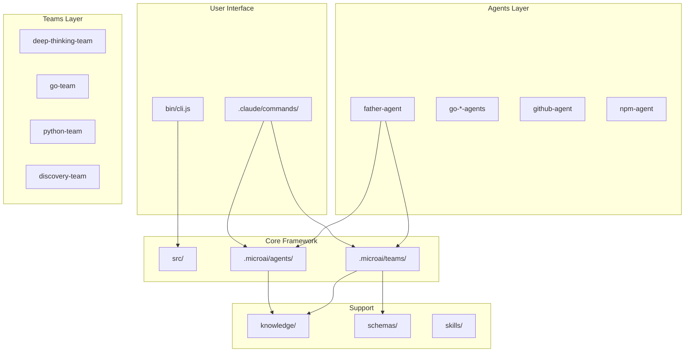

# Discovery Report: dev-team

**Project:** dev-team
**Date:** 2026-01-02
**Session ID:** discovery-001
**Scope:** Full discovery
**Duration:** ~5 minutes

---

## Executive Summary

**dev-team** là một **Claude Code configuration framework** dành cho development teams. Đây là một NPM package (`@microai.club/dev-team`) cung cấp:
- Hệ thống **21 AI Agents** chuyên biệt
- **17 Teams** collaboration workflows
- **CLI tool** để cài đặt và quản lý
- Thiết kế **Vietnamese-first** với hỗ trợ song ngữ

---

## Metrics

| Metric | Value |
|--------|-------|
| Questions Answered | 8 |
| Facts Extracted | 24 |
| Patterns Identified | 4 |
| Components Discovered | 55+ |
| Relationships Mapped | 15+ |
| Confidence | HIGH |

---

## Architecture

```
dev-team/
├── .claude/                 # Claude Code user config
│   ├── CLAUDE.md            # Project context
│   ├── settings.json        # Team settings
│   └── commands/microai/    # Slash commands (16 commands)
│
├── .microai/                # MicroAI Framework
│   ├── agents/              # 21 AI Agents
│   ├── teams/               # 17 Multi-agent Teams
│   ├── commands/            # Team commands
│   ├── knowledge/           # Shared knowledge
│   ├── schemas/             # YAML schemas
│   ├── skills/              # Reusable skills
│   └── scripts/             # Utility scripts
│
├── src/                     # NPM Package source
│   ├── index.js             # Entry point
│   └── commands/            # CLI commands
│
├── bin/                     # CLI executable
│   └── cli.js               # Commander.js CLI
│
├── docs/                    # Documentation
├── templates/               # Installation templates
└── package.json             # NPM config
```

---

## Key Components

### AI Agents (21 agents)

| Agent | Purpose | Location |
|-------|---------|----------|
| **father-agent** | Meta-agent tạo agents khác | `.microai/agents/father-agent/` |
| **go-dev-agent** | Go development specialist | `.microai/agents/go-dev-agent/` |
| **go-refactor-agent** | Go refactoring với 5W2H | `.microai/agents/go-refactor-agent/` |
| **go-review-linus-agent** | Code review Linus style | `.microai/agents/go-review-linus-agent/` |
| **github-agent** | GitHub operations | `.microai/agents/github-agent/` |
| **npm-agent** | NPM package management | `.microai/agents/npm-agent/` |
| **deep-question-agent** | Socratic questioning | `.microai/agents/deep-question-agent/` |
| **first-principles-thinker** | First principles analysis | `.microai/agents/first-principles-thinker/` |
| **root-cause-agent** | Root cause analysis | `.microai/agents/root-cause-agent/` |
| **ab-test-agent** | A/B testing specialist | `.microai/agents/ab-test-agent/` |
| **kanban-agent** | Kanban board management | `.microai/agents/kanban-agent/` |
| **skill-creator-agent** | Skill creation | `.microai/agents/skill-creator-agent/` |
| **white-hacker-agent** | Security testing | `.microai/agents/white-hacker-agent/` |
| **parallels-vm** | VM management | `.microai/agents/parallels-vm/` |
| **ollama-agent** | Local LLM translation | `.microai/agents/ollama-agent/` |
| **fb-post-agent** | Facebook posting | `.microai/agents/fb-post-agent/` |
| **config-agent** | Configuration management | `.microai/agents/config-agent/` |
| **router-agent** | Request routing | `.microai/agents/router-agent/` |
| **test-agent** | Testing specialist | `.microai/agents/test-agent/` |
| **go-dev-portable** | Portable Go dev | `.microai/agents/go-dev-portable/` |
| **go-refactor-portable** | Portable Go refactor | `.microai/agents/go-refactor-portable/` |

### Multi-Agent Teams (17 teams)

| Team | Type | Purpose |
|------|------|---------|
| **deep-thinking-team** | Thinking | Complex problem solving with 20+ agents |
| **go-team** | Pipeline | Go development workflow |
| **python-team** | Pipeline | Python development workflow |
| **book-writer-team** | Pipeline | Book/documentation writing |
| **deep-research** | Pipeline | Research paper analysis |
| **dev-qa** | Dialogue | Developer + QA collaboration |
| **pm-dev** | Dialogue | PM + Developer collaboration |
| **dev-architect** | Dialogue | Developer + Architect collaboration |
| **dev-security** | Dialogue | Developer + Security collaboration |
| **dev-user** | Dialogue | Developer + User collaboration |
| **dev-algo** | Dialogue | Developer + Algorithm specialist |
| **discovery-team** | Pipeline | Codebase discovery |
| **mining-team** | Thinking | Insight mining |
| **math-team** | Thinking | Math problem solving |
| **hacker-security** | Dialogue | Security assessment |
| **project-team** | Pipeline | Project management |
| **youtube-team** | Pipeline | YouTube content creation |

---

## Patterns Identified

### Pattern 1: Agent Structure
**Occurrences:** 21 agents
**Confidence:** HIGH

```
agent-name/
├── agent.md           # YAML frontmatter + System prompt
├── knowledge/         # Domain knowledge
│   ├── knowledge-index.yaml
│   └── *.md           # Knowledge files
├── memory/            # Agent memory
│   ├── context.md
│   ├── decisions.md
│   └── learnings.md
└── templates/         # Output templates
```

### Pattern 2: Team Structure
**Occurrences:** 17 teams
**Confidence:** HIGH

```
team-name/
├── workflow.md        # Team orchestration
├── agents/            # Team-specific agents
├── steps/             # Workflow steps
├── knowledge/         # Shared knowledge
├── memory/            # Team memory
└── templates/         # Output templates
```

### Pattern 3: Command Structure
**Occurrences:** 16+ commands
**Confidence:** HIGH

- Format: YAML frontmatter + Markdown prompt
- Location: `.claude/commands/microai/`
- Naming: `{name}.md` or `{category}/{name}.md`

### Pattern 4: Knowledge Organization
**Occurrences:** All agents/teams
**Confidence:** HIGH

- Index file: `knowledge-index.yaml`
- Numbered files: `01-xxx.md`, `02-xxx.md`, ...
- Shared knowledge referenced across components

---

## Relationship Map



---

## Technology Stack

| Category | Technology | Evidence |
|----------|------------|----------|
| **Runtime** | Node.js >= 18 | `package.json:29` |
| **CLI Framework** | Commander.js | `bin/cli.js:3` |
| **Package Type** | ESM Module | `package.json:6` |
| **UI Libraries** | chalk, ora, inquirer | `package.json:33-37` |
| **File System** | fs-extra | `package.json:35` |
| **AI Platform** | Claude Code | `.claude/`, `.microai/` |
| **Language** | JavaScript (ES Modules) | `src/*.js` |
| **Config Format** | YAML + Markdown | `*.yaml`, `*.md` |

---

## Statistics

| Category | Count |
|----------|-------|
| **Agents** | 21 |
| **Teams** | 17 |
| **Commands** | 16+ |
| **Skills** | 8+ |
| **Schemas** | 5+ |
| **JavaScript Lines** | ~200 |
| **Markdown Lines** | ~50,000+ |
| **YAML Lines** | ~5,000+ |
| **Total Directories** | 100+ |
| **Total Files** | 300+ |

---

## Key Insights

1. **Framework-First Design**: Đây là một framework để tạo và quản lý AI agents, không phải một application thông thường

2. **Vietnamese-First**: Thiết kế ưu tiên tiếng Việt với hỗ trợ song ngữ (`language: vi`)

3. **Multi-Agent Architecture**: Hỗ trợ cả single agents và multi-agent teams với workflow phức tạp

4. **Knowledge-Driven**: Mỗi agent có knowledge base riêng, organized theo pattern nhất quán

5. **Extensible**: Father-agent có thể tạo agents/teams mới theo templates

6. **Memory System**: Agents có memory (context, decisions, learnings) để maintain state

7. **CLI Tool**: NPM package với CLI để install framework vào projects khác

---

## Open Questions

| Priority | Question | Reason |
|----------|----------|--------|
| Medium | Install command hoạt động chi tiết thế nào? | Chỉ thấy export, chưa thấy full implementation |
| Low | Hooks system ở đâu? | README mentions nhưng chưa thấy trong codebase |
| Low | Skills framework chi tiết? | Thư mục tồn tại nhưng chưa explore sâu |

---

## Recommendations

### Immediate Actions
1. Explore `src/commands/install.js` để hiểu CLI workflow
2. Document skills framework nếu chưa có

### Future Exploration
1. Deep dive vào từng agent để hiểu capabilities
2. Analyze team workflows chi tiết
3. Map dependencies giữa components

---

## Appendix

### Files Read

| File | Purpose |
|------|---------|
| `package.json` | NPM configuration |
| `README.md` | Project overview |
| `.claude/CLAUDE.md` | Claude Code context |
| `bin/cli.js` | CLI entry point |
| `src/index.js` | Package entry point |
| `.microai/agents/father-agent/agent.md` | Meta-agent definition |

### Session Metadata

```yaml
session:
  id: discovery-001
  date: 2026-01-02
  scope: full
  depth: 2

questions:
  answered: 8
  categories: [architecture, entry_points, dependencies, patterns]

confidence:
  overall: HIGH
  evidence_backed: 100%
```

---

*Report generated by Discovery Team v1.0*
*2026-01-02*
