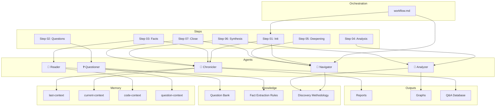

# Self-Discovery Report: discovery-team

**Project:** discovery-team
**Date:** 2026-01-02
**Session ID:** discovery-002
**Scope:** Self-analysis
**Duration:** ~3 minutes

---

## Executive Summary

**discovery-team** là một **multi-agent team** được thiết kế để khám phá codebase một cách có hệ thống, dựa hoàn toàn trên facts từ code thực tế. Team gồm 5 agents với các vai trò rõ ràng, hoạt động theo workflow 7 bước với 4-layer context system.

**Core Philosophy:** "Facts-Only" - Mọi finding phải có evidence từ code, không giả định.

---

## Metrics

| Metric | Value |
|--------|-------|
| Files Analyzed | 28 |
| Directories | 17 |
| Agents | 5 |
| Workflow Steps | 7 |
| Question Bank Size | 32 questions |
| Knowledge Files | 6 |
| Templates | 4 |
| Memory Files | 4 |
| Total Lines | ~3,500 |
| Confidence | HIGH |

---

## Architecture

```
discovery-team/
├── workflow.md              # Main orchestration (506 lines)
│
├── agents/                  # 5 AI Agents
│   ├── navigator-agent.md   # 🎯 Lead, orchestration (184 lines)
│   ├── questioner-agent.md  # ❓ Question selection (200 lines)
│   ├── reader-agent.md      # 📖 Fact extraction (228 lines)
│   ├── analyzer-agent.md    # 🧠 Pattern recognition (273 lines)
│   └── chronicler-agent.md  # 📝 Context & reporting (398 lines)
│
├── steps/                   # 7 Workflow Steps
│   ├── step-01-init.md
│   ├── step-02-question-selection.md
│   ├── step-03-fact-gathering.md
│   ├── step-04-analysis.md
│   ├── step-05-deepening-loop.md
│   ├── step-06-synthesis.md
│   └── step-07-close.md
│
├── knowledge/               # Domain Knowledge
│   ├── knowledge-index.yaml
│   ├── question-bank.yaml   # 32 questions, 9 categories
│   ├── shared/
│   │   ├── discovery-methodology.md
│   │   └── fact-extraction-rules.md
│   ├── reader/
│   │   └── code-reading-patterns.md
│   └── analyzer/
│       └── analysis-frameworks.md
│
├── memory/                  # Context Persistence
│   ├── last-context.md      # Session history
│   ├── current-context.md   # Active session
│   ├── code-context.md      # Facts database
│   └── question-context.md  # Q&A state
│
├── templates/               # Output Templates
│   ├── structured-report.md
│   ├── knowledge-graph.md
│   ├── qa-entry.md
│   └── session-summary.md
│
└── outputs/                 # Generated Outputs
    ├── reports/
    ├── graphs/
    └── qa-database/
```

---

## Team Composition

| Agent | Role | Icon | Color | Key Responsibility |
|-------|------|------|-------|-------------------|
| **Navigator** | Lead | 🎯 | #4A90D9 | Session management, workflow control, context coordination |
| **Questioner** | Question Manager | ❓ | #9B59B6 | Question selection, prioritization, dependency resolution |
| **Reader** | Fact Extractor | 📖 | #27AE60 | **Facts-Only** code reading, evidence collection |
| **Analyzer** | Pattern Finder | 🧠 | #E74C3C | Pattern recognition, relationship mapping, gap analysis |
| **Chronicler** | Memory Keeper | 📝 | #F39C12 | Context persistence, report generation |

---

## Patterns Identified

### Pattern 1: Facts-Only Philosophy

**Evidence:** `reader-agent.md:44-49`, `fact-extraction-rules.md:8-15`
**Occurrences:** Throughout entire system
**Confidence:** HIGH

```
╔═══════════════════════════════════════════════════════════════════╗
║   IF YOU DIDN'T SEE IT IN THE CODE, DON'T CLAIM IT                ║
║   IF YOU CLAIM IT, SHOW THE CODE                                   ║
╚═══════════════════════════════════════════════════════════════════╝
```

**Forbidden words:** probably, likely, maybe, seems, I think, should be, typically

**Implications:** Mọi finding trong discovery session phải được backed bởi evidence cụ thể (file:line).

---

### Pattern 2: 4-Layer Context System

**Evidence:** `workflow.md:44-63`, `memory/`
**Occurrences:** 4 context files
**Confidence:** HIGH

```
┌─────────────────────────────────────────────────────────────────┐
│                    CONTEXT LAYER                                 │
├─────────────────────────────────────────────────────────────────┤
│  ┌─────────────────┐    ┌─────────────────┐    ┌─────────────┐  │
│  │  last-context   │    │ current-context │    │ code-context│  │
│  │    (history)    │◄───│    (active)     │◄───│   (facts)   │  │
│  │                 │    │                 │    │             │  │
│  │ • Prev sessions │    │ • This session  │    │ • Files read│  │
│  │ • Cumulative    │    │ • Progress      │    │ • Facts     │  │
│  │   knowledge     │    │ • Findings      │    │ • Evidence  │  │
│  └─────────────────┘    └─────────────────┘    └─────────────┘  │
│           │                      │                     │        │
│           └──────────────────────┴─────────────────────┘        │
│                              │                                   │
│                              ▼                                   │
│                    ┌─────────────────┐                          │
│                    │question-context │                          │
│                    │  (Q&A state)    │                          │
│                    └─────────────────┘                          │
└─────────────────────────────────────────────────────────────────┘
```

**Implications:** Cho phép discovery liên tục qua nhiều sessions, không mất context.

---

### Pattern 3: Question-Driven Discovery

**Evidence:** `question-bank.yaml:1-543`
**Occurrences:** 32 questions across 9 categories
**Confidence:** HIGH

| Category | Icon | Questions | Depth Distribution |
|----------|------|-----------|-------------------|
| Kiến trúc & Cấu trúc | 🏗️ | 5 | 1:D1, 3:D2, 1:D3 |
| Điểm khởi đầu | 🚪 | 4 | 1:D1, 3:D2 |
| Luồng dữ liệu | 🔄 | 4 | 4:D2, 1:D3 |
| Thư viện & Services | 📦 | 4 | 1:D1, 3:D2 |
| Patterns & Conventions | 📐 | 5 | 2:D1, 3:D2 |
| Testing | 🧪 | 4 | 1:D1, 3:D2 |
| Bảo mật & Hiệu năng | 🔒 | 4 | 4:D2 |
| Build & Deploy | 🚀 | 3 | 1:D1, 2:D2 |
| Câu hỏi tùy chỉnh | ✏️ | 0 | User-defined |

**Total:** 32 questions (8 Depth-1, 19 Depth-2, 5 Depth-3)

---

### Pattern 4: 7-Step Workflow

**Evidence:** `workflow.md:146-198`, `steps/`
**Occurrences:** 7 step files
**Confidence:** HIGH

```
User Request
   ↓
┌──────────────────────────────────────────────────────────────────┐
│ Step 01: INIT                                                     │
│          🎯 Navigator + 📝 Chronicler                            │
│          Load contexts, setup session                             │
├──────────────────────────────────────────────────────────────────┤
│ Step 02: QUESTION SELECTION        ═══ BREAKPOINT ═══            │
│          ❓ Questioner                                            │
│          Filter, prioritize, present questions                    │
├──────────────────────────────────────────────────────────────────┤
│ Step 03: FACT GATHERING            ═══ BREAKPOINT ═══            │
│          📖 Reader + 📝 Chronicler                               │
│          Read code, extract facts, record evidence                │
├──────────────────────────────────────────────────────────────────┤
│ Step 04: ANALYSIS                  ═══ BREAKPOINT ═══            │
│          🧠 Analyzer                                              │
│          Find patterns, map relationships, identify gaps          │
├──────────────────────────────────────────────────────────────────┤
│ Step 05: DEEPENING LOOP (max 3 iterations)                       │
│          🎯 Navigator                                             │
│          Decide: Go deeper? Loop to Step 03 if needed            │
├──────────────────────────────────────────────────────────────────┤
│ Step 06: SYNTHESIS                                               │
│          📝 Chronicler + 🧠 Analyzer                             │
│          Compile report, build graph, generate Q&A entries        │
├──────────────────────────────────────────────────────────────────┤
│ Step 07: CLOSE                                                   │
│          🎯 Navigator + 📝 Chronicler                            │
│          Save contexts, archive session, display summary          │
└──────────────────────────────────────────────────────────────────┘
   ↓
Outputs: Structured Report + Knowledge Graph + Q&A Database
```

---

## Communication System

**Evidence:** `workflow.md:30-42`

| Topic | Publisher | Subscribers |
|-------|-----------|-------------|
| `context_update` | Navigator | Questioner, Reader, Analyzer |
| `question_selected` | Questioner | Reader |
| `fact_extracted` | Reader | Analyzer, Chronicler |
| `pattern_detected` | Analyzer, Reader | Navigator, Chronicler |
| `analysis_complete` | Analyzer | Navigator, Chronicler |
| `synthesis_ready` | Chronicler | Navigator |

---

## Key Features

### 1. Checkpoint System
**Evidence:** `workflow.md:20-28`

- **Auto-checkpoint triggers:** after_question_answered, after_phase_complete, on_user_request
- **Storage:** `memory/checkpoints/`
- **Resume:** `*resume` command

### 2. Observer Controls
**Evidence:** `workflow.md:275-328`

| Category | Commands |
|----------|----------|
| Navigation | `[Enter]`, `*pause`, `*skip`, `*skip-to:<N>`, `*exit` |
| Depth Control | `*deep`, `*surface`, `*depth:1/2/3` |
| Context | `*context`, `*history`, `*facts`, `*questions` |
| Output | `*graph`, `*report`, `*export`, `*export:report/graph/qa` |
| Session | `*checkpoint`, `*resume`, `*checkpoints`, `*rollback:<id>` |
| Agent Injection | `@navigator:`, `@questioner:`, `@reader:`, `@analyzer:`, `@chronicler:` |

### 3. Confidence Levels
**Evidence:** `fact-extraction-rules.md:185-227`

| Level | Criteria | Action |
|-------|----------|--------|
| **HIGH** | Direct code evidence, unambiguous | Claim with full confidence |
| **MEDIUM** | Indirect evidence, some inference | Claim with caveat |
| **NO CLAIM** | Insufficient evidence | Don't make the claim at all |

**Note:** Never use "LOW" - if uncertain, don't claim.

---

## Relationship Map



---

## Statistics

| Category | Count |
|----------|-------|
| Total Lines of Code | ~3,500 |
| Agent Definitions | 5 (1,283 lines total) |
| Workflow Definition | 1 (506 lines) |
| Step Definitions | 7 |
| Knowledge Files | 6 |
| Question Categories | 9 |
| Total Questions | 32 |
| Output Templates | 4 |
| Context Types | 4 |
| Observer Commands | 25+ |

---

## Self-Referential Insights

1. **Well-Documented System**: Mỗi agent có persona, responsibilities, system prompt, và example outputs rõ ràng - cho phép Claude Code hiểu và execute role correctly.

2. **Vietnamese-First Design**: Question bank và category names đều tiếng Việt, consistent với overall dev-team philosophy.

3. **Evidence-Obsessed**: Toàn bộ hệ thống xoay quanh "Facts-Only" philosophy - Reader Agent có "Reader's Oath" nghiêm ngặt.

4. **Session Continuity**: 4-layer context system (last/current/code/question) cho phép discovery liên tục qua nhiều sessions mà không mất context.

5. **Extensible Question Bank**: Category "custom" cho phép user thêm câu hỏi riêng mà không modify core structure.

6. **Breakpoint-Based Workflow**: 3 breakpoints cho user intervention - không chạy blindly mà có checkpoints để verify.

7. **Deepening Loop**: Maximum 3 iterations cho derived questions - prevents infinite exploration.

---

## Open Questions

| Priority | Question | Reason |
|----------|----------|--------|
| Low | Knowledge files cho chronicler và questioner ở đâu? | `knowledge/chronicler/` và `knowledge/questioner/` directories exist but empty |
| Low | Kanban integration hoạt động thế nào? | Config exists (`workflow.md:64-78`) nhưng chưa có board.yaml |

---

## Recommendations

### Immediate
1. Populate empty knowledge directories (`knowledge/chronicler/`, `knowledge/questioner/`)
2. Create Kanban board template if needed

### Future
1. Consider adding more custom questions specific to common project types
2. Add session archiving automation

---

## Appendix: Files Read

| File | Purpose | Lines |
|------|---------|-------|
| `workflow.md` | Main orchestration | 506 |
| `agents/navigator-agent.md` | Lead agent definition | 184 |
| `agents/questioner-agent.md` | Question manager | 200 |
| `agents/reader-agent.md` | Fact extractor | 228 |
| `agents/analyzer-agent.md` | Pattern finder | 273 |
| `agents/chronicler-agent.md` | Memory keeper | 398 |
| `knowledge/question-bank.yaml` | 32 questions | 543 |
| `knowledge/shared/fact-extraction-rules.md` | Extraction rules | 268 |
| `memory/last-context.md` | Session history | 106 |
| `memory/question-context.md` | Q&A state | 98 |

---

*Report generated by Discovery Team v1.0*
*Self-discovery session: 2026-01-02*
