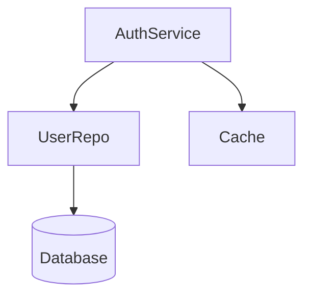

# Step 04: Analysis

## Trigger
- After Step 03 complete
- Facts gathered and verified

## Agents
- 🧠 **Analyzer** (lead)
- 📝 **Chronicler** (support)
- 🎯 **Navigator** (oversight)

## Actions

### 1. Analyzer: Collect and Group Facts
```yaml
input: code-context.facts[]

group_by:
  - category (architecture, data_flow, etc.)
  - type (structure, behavior, relationship, pattern)
  - file location

identify:
  - Overlapping evidence
  - Contradictions
  - Gaps
```

### 2. Analyzer: Pattern Recognition
```yaml
# A pattern requires 2+ occurrences
for each potential_pattern:
  check:
    - Appears in multiple locations?
    - Consistent implementation?
    - Named consistently?

  if: pattern_confirmed
    create:
      id: "pat-{sequence}"
      name: "{descriptive name}"
      type: "structural|behavioral|architectural"
      occurrences: {N}
      evidence_locations: []
      description: |
        {what the pattern is}
      implications: |
        {what it means}
```

### 3. Analyzer: Relationship Mapping
```yaml
for each component_pair:
  check_relationship:
    - Direct import/call?
    - Shared dependency?
    - Data flow?

  if: relationship_found
    create:
      from: "{component A}"
      to: "{component B}"
      type: "uses|extends|implements|calls|reads|writes"
      strength: "direct|indirect|inferred"
      evidence:
        file: ""
        line: ""

build_graph:
  nodes: components[]
  edges: relationships[]
```

### 4. Analyzer: Gap Identification
```yaml
identify_gaps:
  # 1. Unanswered questions
  unanswered:
    source: question_context
    filter: status == "unanswered"

  # 2. Incomplete patterns
  incomplete:
    for each pattern:
      if: occurrences < expected
        flag: "pattern may be incomplete"

  # 3. Missing relationships
  missing:
    for each component:
      if: isolated (no in/out edges)
        flag: "component relationship unclear"

  # 4. Cross-reference with last-context
  compare:
    if: last_context.component not in current
      flag: "previously known component not found"
```

### 5. Analyzer: Cross-Reference History
```yaml
if: last_context exists
  compare:
    # New discoveries
    new_components:
      current - last_context

    # Changes
    modified:
      components with different attributes

    # Missing
    not_found:
      last_context - current

  note:
    - Evolution patterns
    - Knowledge gaps filled
    - Regressions
```

### 6. Analyzer: Generate Analysis Report
```markdown
🧠 **Analyzer**: Analysis Complete

## Patterns Identified: {N}

| Pattern | Type | Occurrences | Confidence |
|---------|------|-------------|------------|
| Repository | Structural | 5 | HIGH |
| Factory | Structural | 3 | HIGH |
| Middleware Chain | Behavioral | 1 | MEDIUM |

## Relationships Mapped: {N}



## Gaps Identified: {N}

| Priority | Gap | Reason |
|----------|-----|--------|
| HIGH | Cache invalidation | No invalidation code found |
| MEDIUM | Error handling | Inconsistent patterns |
| LOW | Logging | No logger found |

## Comparison with Last Session

| Metric | Last | Current | Change |
|--------|------|---------|--------|
| Components | 5 | 8 | +3 |
| Patterns | 2 | 4 | +2 |
| Relationships | 10 | 18 | +8 |

## Insights

1. {Key insight 1}
2. {Key insight 2}
```

## BREAKPOINT

```markdown
═══════════════ BREAKPOINT: Review Analysis ═══════════════

**Analysis summary:**
- Patterns: {N}
- Relationships: {N}
- Gaps: {N}

**Key insights:**
{top 3 insights}

**Recommended actions:**
- [ ] Deeper exploration of {area}
- [ ] Follow-up questions for {gap}

Options:
[Enter] Continue to deepening check
*deep → Force deeper exploration
*skip → Skip to synthesis
*review:{type} → Review details
```

## Output
```yaml
analysis:
  patterns:
    - {pattern objects}
  relationships:
    - {relationship objects}
  gaps:
    - {gap objects}
  insights:
    - {insight objects}
  comparison:
    with_last_session: {comparison object}
```

## Transition
→ Step 05: Deepening Loop
