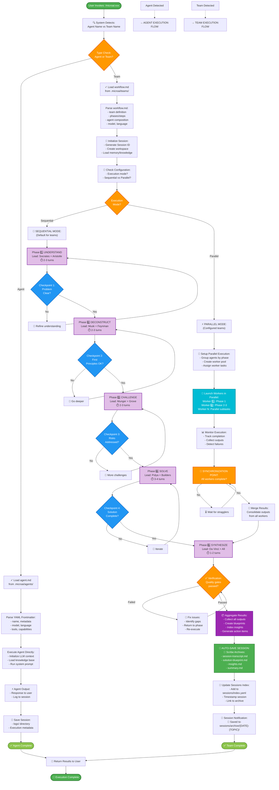

```mermaid
flowchart TD
    Start([User Invokes: /microai:xxx]) --> Parse["🔍 System Detects:<br/>Agent Name vs Team Name"]

    Parse --> Decision{Type Check:<br/>Agent or Team?}

    decision_agent["Agent Detected"] -.-> AgentFlow["→ AGENT EXECUTION FLOW"]
    decision_team["Team Detected"] -.-> TeamFlow["→ TEAM EXECUTION FLOW"]

    Decision -->|Agent| AgentPath["✓ Load agent.md<br/>from .microai/agents/"]
    Decision -->|Team| TeamPath["✓ Load workflow.md<br/>from .microai/teams/"]

    AgentPath --> AgentLoad["Parse YAML Frontmatter:<br/>- name, metadata<br/>- model, language<br/>- tools, capabilities"]
    AgentLoad --> AgentExec["Execute Agent Directly:<br/>- Initialize LLM context<br/>- Load knowledge base<br/>- Run system prompt"]
    AgentExec --> AgentOutput["⚡ Agent Output:<br/>- Response to user<br/>- Log to session"]
    AgentOutput --> AgentSave["💾 Save Session:<br/>- logs/ directory<br/>- Execution metadata"]
    AgentSave --> EndAgent(["✅ Agent Complete"])

    TeamPath --> TeamLoad["Parse workflow.md:<br/>- team definition<br/>- phases/steps<br/>- agent composition<br/>- model, language"]
    TeamLoad --> SessionInit["📝 Initialize Session:<br/>- Generate Session ID<br/>- Create workspace<br/>- Load memory/knowledge"]
    SessionInit --> CheckConfig["🔧 Check Configuration:<br/>- Execution mode?<br/>- Sequential vs Parallel?"]

    CheckConfig --> ConfigDecision{Execution<br/>Mode?}

    ConfigDecision -->|Sequential| SeqMode["🔄 SEQUENTIAL MODE:<br/>(Default for teams)"]
    ConfigDecision -->|Parallel| ParaMode["⚡ PARALLEL MODE:<br/>(Configured teams)"]

    SeqMode --> Phase1["Phase 1️⃣ UNDERSTAND<br/>Lead: Socrates + Aristotle<br/>⏱️ 2-3 turns"]
    Phase1 --> SeqCheck1{"Checkpoint 1:<br/>Problem<br/>Clear?"}
    SeqCheck1 -->|No| Phase1Retry["🔄 Refine understanding"]
    Phase1Retry --> Phase1
    SeqCheck1 -->|Yes| Phase2["Phase 2️⃣ DECONSTRUCT<br/>Lead: Musk + Feynman<br/>⏱️ 2-3 turns"]
    Phase2 --> SeqCheck2{"Checkpoint 2:<br/>First<br/>Principles OK?"}
    SeqCheck2 -->|No| Phase2Retry["🔄 Go deeper"]
    Phase2Retry --> Phase2
    SeqCheck2 -->|Yes| Phase3["Phase 3️⃣ CHALLENGE<br/>Lead: Munger + Grove<br/>⏱️ 2-3 turns"]
    Phase3 --> SeqCheck3{"Checkpoint 3:<br/>Risks<br/>Addressed?"}
    SeqCheck3 -->|No| Phase3Retry["🔄 More challenges"]
    Phase3Retry --> Phase3
    SeqCheck3 -->|Yes| Phase4["Phase 4️⃣ SOLVE<br/>Lead: Polya + Builders<br/>⏱️ 3-4 turns"]
    Phase4 --> SeqCheck4{"Checkpoint 4:<br/>Solution<br/>Complete?"}
    SeqCheck4 -->|No| Phase4Retry["🔄 Iterate"]
    Phase4Retry --> Phase4
    SeqCheck4 -->|Yes| Phase5["Phase 5️⃣ SYNTHESIZE<br/>Lead: Da Vinci + All<br/>⏱️ 1-2 turns"]

    ParaMode --> ParaSetup["🎯 Setup Parallel Execution:<br/>- Group agents by phase<br/>- Create worker pool<br/>- Assign worker tasks"]
    ParaSetup --> ParaLaunch["🚀 Launch Workers in Parallel:<br/>Worker 1️⃣: Phase 1<br/>Worker 2️⃣: Phase 2-3<br/>Worker N: Parallel subtasks"]
    ParaLaunch --> ParaMonitor["📊 Monitor Execution:<br/>- Track completion<br/>- Collect outputs<br/>- Detect failures"]
    ParaMonitor --> SyncPoint["🔄 SYNCHRONIZATION POINT:<br/>All workers complete?"]
    SyncPoint -->|No| ParaWait["⏳ Wait for stragglers"]
    ParaWait --> SyncPoint
    SyncPoint -->|Yes| ParaMerge["🔀 Merge Results:<br/>Consolidate outputs<br/>from all workers"]
    ParaMerge --> Phase5

    Phase5 --> Verify{"✅ Verification:<br/>Quality gates<br/>passed?"}

    Verify -->|Failed| VerifyFix["🔧 Fix issues:<br/>- Identify gaps<br/>- Return to phase<br/>- Re-execute"]
    VerifyFix --> Verify

    Verify -->|Passed| Aggregate["📦 Aggregate Results:<br/>- Collect all outputs<br/>- Create blueprints<br/>- Index insights<br/>- Generate action items"]

    Aggregate --> Save["💾 AUTO-SAVE SESSION:<br/>📝 Scribe Archives:<br/>- session-transcript.md<br/>- solution-blueprint.md<br/>- insights.md<br/>- summary.md"]

    Save --> Index["📇 Update Sessions Index:<br/>- Add to sessions/index.yaml<br/>- Timestamp session<br/>- Link to archive"]

    Index --> Notify["🔔 Session Notification:<br/>📝 Saved to:<br/>sessions/archive/{DATE}-{TOPIC}/"]

    Notify --> EndTeam(["✅ Team Complete"])

    EndAgent --> FinalOutput["🎯 Return Results to User"]
    EndTeam --> FinalOutput
    FinalOutput --> End(["🏁 Execution Complete"])

    style Start fill:#4CAF50,color:#fff,stroke:#2E7D32,stroke-width:3px
    style Decision fill:#FF9800,color:#fff,stroke:#E65100,stroke-width:2px
    style ConfigDecision fill:#FF9800,color:#fff,stroke:#E65100,stroke-width:2px
    style Verify fill:#FF9800,color:#fff,stroke:#E65100,stroke-width:2px
    style SyncPoint fill:#FF9800,color:#fff,stroke:#E65100,stroke-width:2px
    style SeqCheck1 fill:#2196F3,color:#fff,stroke:#1565C0,stroke-width:2px
    style SeqCheck2 fill:#2196F3,color:#fff,stroke:#1565C0,stroke-width:2px
    style SeqCheck3 fill:#2196F3,color:#fff,stroke:#1565C0,stroke-width:2px
    style SeqCheck4 fill:#2196F3,color:#fff,stroke:#1565C0,stroke-width:2px
    style Phase1 fill:#E1BEE7,color:#333,stroke:#7B1FA2,stroke-width:2px
    style Phase2 fill:#E1BEE7,color:#333,stroke:#7B1FA2,stroke-width:2px
    style Phase3 fill:#E1BEE7,color:#333,stroke:#7B1FA2,stroke-width:2px
    style Phase4 fill:#E1BEE7,color:#333,stroke:#7B1FA2,stroke-width:2px
    style Phase5 fill:#E1BEE7,color:#333,stroke:#7B1FA2,stroke-width:2px
    style ParaLaunch fill:#00BCD4,color:#fff,stroke:#00838F,stroke-width:2px
    style Aggregate fill:#9C27B0,color:#fff,stroke:#6A1B9A,stroke-width:2px
    style Save fill:#4CAF50,color:#fff,stroke:#2E7D32,stroke-width:2px
    style EndAgent fill:#8BC34A,color:#fff,stroke:#558B2F,stroke-width:2px
    style EndTeam fill:#8BC34A,color:#fff,stroke:#558B2F,stroke-width:2px
    style End fill:#4CAF50,color:#fff,stroke:#2E7D32,stroke-width:3px
```
